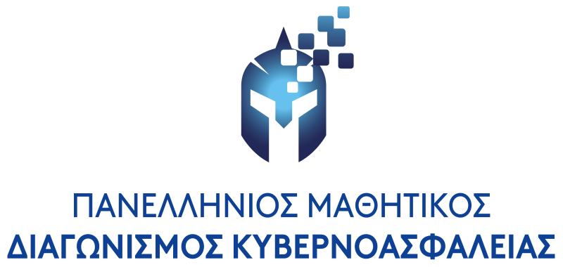
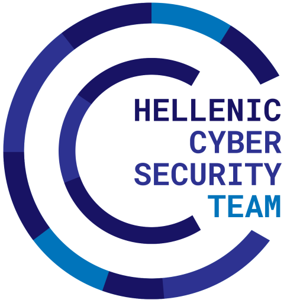
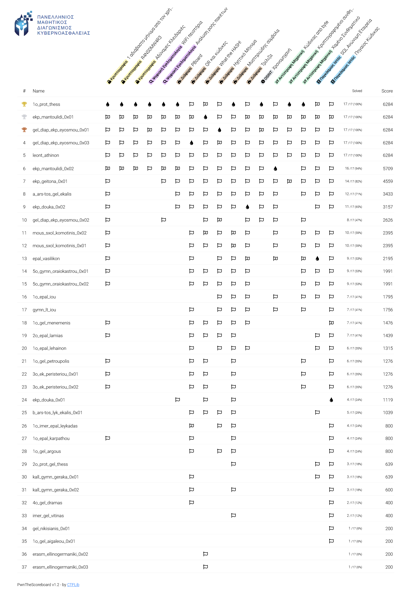

# Πανελλήνιος Μαθητικός Διαγωνισμός Κυβερνοασφάλειας (ΠΜΔΚ) 2023

O 1ος [Πανελλήνιος Μαθητικός Διαγωνισμός Κυβερνοασφάλειας](https://ecsc.gr/index.php/ethical-hacking-comp/) είναι η πρώτη έκδοση του πρώτου πανελλαδικού διαδικτυακού Jeopardy-style Capture-The-Flag διαγωνισμού για μαθητές και μαθήτριες της Α΄, Β΄ και Γ΄ Λυκείου όλων των σχολείων της Ελλάδας. Ο διαγωνισμός διοργανώνεται από το [Τμήμα Ψηφιακών Συστημάτων του Πανεπιστημίου Πειραιώς](https://www.ds.unipi.gr) με την υποστήριξη των μελών της [Εθνικής Ομάδας Κυβερνοασφάλειας](https://ecsc.gr).

  
  
  

## Κύριες Δοκιμασίες

|   # | Κατηγορία              | Δοκιμασία                                   | Δυσκολία           | Λύσεις | Δημιουργός                                                    |
| --: | :--------------------- | :------------------------------------------ | :----------------- | -----: | :------------------------------------------------------------ |
|   1 | Παγκόσμιος Ιστός       | [Πηγαίος Κώδικας](challenge-01-source-code/writeup) | Εύκολη             | 33     | [Αθανάσιος Γραμματόπουλος](https://github.com/gramthanos)     |
|   2 | Αντίστροφη Μηχανική    | [Χαμένο Συνθηματικό](challenge-02-lost-password/writeup) | Εύκολη             | 19     | [Αριστομένης Τρέσσος](https://github.com/Tressos-Aristomenis) |
|   3 | Κρυπτογραφία           | [1 αδιάβαστο μήνυμα από τον χρήστη Βιζενέριο](challenge-03-vigenere-cipher/writeup) | Εύκολη             | 21     | [Αριστομένης Τρέσσος](https://github.com/Tressos-Aristomenis) |
|   4 | Παγκόσμιος Ιστός       | [SQL Ανώνυμη Εταιρεία](challenge-04-sql-limited-company/writeup) | Εύκολη             | 20     | [Αθανάσιος Γραμματόπουλος](https://github.com/gramthanos)     |
|   5 | Διάφορα                | [QR και κώδικες](challenge-05-qr-and-codes/writeup) | Εύκολη             | 28     | [Αθανάσιος Γραμματόπουλος](https://github.com/gramthanos)     |
|   6 | Ψηφιακή Εγκληματολογία | [Ανάλυση ροής πακέτων](challenge-06-packet-flow-investigation/writeup) | Μέτρια             | 8      | [Μιχάλης Τακαρώνης](https://github.com/R3dSh3rl0ck)           |
|   7 | Διάφορα                | [Τρίλιζα](challenge-07-tic-tac-toe/writeup) | Μέτρια             | 19     | [Αθανάσιος Γραμματόπουλος](https://github.com/gramthanos)     |
|   8 | Αντίστροφη Μηχανική    | [Κρυπτογραφημένο συνθηματικό](challenge-08-encrypted-password/writeup) | Μέτρια             | 6      | [Αθανάσιος Γραμματόπουλος](https://github.com/gramthanos)     |
|   9 | Διάφορα                | [Ηχητικό Μήνυμα](challenge-09-sound-messages/writeup) | Mέτρια             | 23     | [Μιχάλης Τακαρώνης](https://github.com/R3dSh3rl0ck)           |
|  10 | Ψηφιακή Εγκληματολογία | [WiFi πειστήρια](challenge-10-wifi-evidence/writeup) | Δύσκολη            | 6      | [Αθανάσιος Γραμματόπουλος](https://github.com/gramthanos)     |
|  11 | Κρυπτογραφία           | [Αδύναμες Κλειδαριές](challenge-11-weak-locks/writeup) | Δύσκολη            | 6      | [Αριστομένης Τρέσσος](https://github.com/Tressos-Aristomenis) |
|  12 | Κρυπτογραφία           | [R4NS0MW4R3](challenge-12-ransomware/writeup) | Υπερβολικά δύσκολη | 6      | [Αριστομένης Τρέσσος](https://github.com/Tressos-Aristomenis) |

## Demo Δοκιμασίες

|   # | Κατηγορία              | Δοκιμασία                                   | Δυσκολία           | Λύσεις | Δημιουργός                                                    |
| --: | :--------------------- | :------------------------------------------ | :----------------- | -----: | :------------------------------------------------------------ |
|   1 | Παγκόσμιος Ιστός       | [Μαγειρική στο Διαδίκτυο](challenge-demo-01-web-cooking/writeup) | Εύκολη             | 29     | [Αθανάσιος Γραμματόπουλος](https://github.com/gramthanos)     |
|   2 | Κρυπτογραφία           | [Το bar στην οδό Καίσαρα](challenge-demo-02-the-bar-at-caesar-street/writeup) | Εύκολη             | 33     | [Μιχάλης Τακαρώνης](https://github.com/R3dSh3rl0ck)           |
|   3 | Διάφορα                | [Κατεστραμμένη Φωτογραφία](challenge-demo-03-corrupted-image/writeup) | Εύκολη             | 34     | [Αθανάσιος Γραμματόπουλος](https://github.com/gramthanos)     |
|   4 | Ψηφιακή Εγκληματολογία | [Περίεργα Σχήματα](challenge-demo-04-weird-shapes/writeup) | Εύκολη             | 31     | [Αθανάσιος Γραμματόπουλος](https://github.com/gramthanos)     |

## Extra Δοκιμασίες

|   # | Κατηγορία              | Δοκιμασία                                   | Δυσκολία           | Λύσεις | Δημιουργός                                                    |
| --: | :--------------------- | :------------------------------------------ | :----------------- | -----: | :------------------------------------------------------------ |
|   1 | Διάφορα                | [What the HASH!](challenge-extra-01-what-the-hash/writeup) | Εύκολη             | 23     | [Μιχάλης Τακαρώνης](https://github.com/R3dSh3rl0ck)           |
|   2 | OSINT                  | [Χρονομηχανή](challenge-extra-02-timemachine/writeup) | Εύκολη             | 10     | [Αθανάσιος Γραμματόπουλος](https://github.com/gramthanos)     |
|   3 | Διάφορα                | [Μυστηριώδης σύμβολα](challenge-extra-03-mysterious-symbols/writeup) | Εύκολη             | 30     | [Αθανάσιος Γραμματόπουλος](https://github.com/gramthanos)     |
|   4 | Αντίστροφη Μηχανική    | [Κώδικας από byte](challenge-extra-04-code-of-bytes/writeup) | Μέτρια             | 15     | [Αθανάσιος Γραμματόπουλος](https://github.com/gramthanos)     |
|   5 | Διάφορα                | [PBoard](challenge-extra-05-pboard/writeup) | Μέτρια             | 10     | [Αθανάσιος Γραμματόπουλος](https://github.com/gramthanos)     |

## Τελικός πίνακας βαθμολογίας

| Θέση | Ομάδα                      | Λύσεις | Πόντοι | 
| ---: | :------------------------- | -----: | :----- |
| 1    | 1o_prot_thess              | 17     | 6284   |
| 2    | ekp_mantoulidi_0x01        | 17     | 6284   |
| 3    | gel_diap_ekp_eyosmou_0x01  | 17     | 6284   |
| 4    | gel_diap_ekp_eyosmou_0x03  | 17     | 6284   |
| 5    | leont_athinon              | 17     | 6284   |
| 6    | ekp_mantoulidi_0x02        | 16     | 5709   |
| 7    | ekp_geitona_0x01           | 14     | 4559   |
| 8    | a_ars-tos_gel_ekalis       | 12     | 3433   |
| 9    | ekp_douka_0x02             | 11     | 3157   |
| 10   | gel_diap_ekp_eyosmou_0x02  | 8      | 2626   |
| 11   | mous_sxol_komotinis_0x02   | 10     | 2395   |
| 12   | mous_sxol_komotinis_0x01   | 10     | 2395   |
| 13   | epal_vasilikon             | 9      | 2195   |
| 14   | 5o_gymn_oraiokastrou_0x01  | 9      | 1991   |
| 15   | 5o_gymn_oraiokastrou_0x02  | 9      | 1991   |
| 16   | 1o_epal_iou                | 7      | 1795   |
| 17   | gymn_lt_iou                | 7      | 1756   |
| 18   | 1o_gel_menemenis           | 7      | 1476   |
| 19   | 2o_epal_lamias             | 7      | 1439   |
| 20   | 1o_epal_lehainon           | 6      | 1315   |
| 21   | 1o_gel_petroupolis         | 6      | 1276   |
| 22   | 3o_ek_peristeriou_0x01     | 6      | 1276   |
| 23   | 3o_ek_peristeriou_0x02     | 6      | 1276   |
| 24   | ekp_douka_0x01             | 4      | 1119   |
| 25   | b_ars-tos_lyk_ekalis_0x01  | 5      | 1039   |
| 26   | 1o_imer_epal_leykadas      | 4      | 800    |
| 27   | 1o_epal_karpathou          | 4      | 800    |
| 28   | 1o_gel_argous              | 4      | 800    |
| 29   | 2o_prot_gel_thess          | 3      | 639    |
| 30   | kall_gymn_geraka_0x01      | 3      | 639    |
| 31   | kall_gymn_geraka_0x02      | 3      | 600    |
| 32   | 4o_gel_dramas              | 2      | 400    |
| 33   | imer_gel_vitinas           | 2      | 400    |
| 34   | gel_nikisianis_0x01        | 1      | 200    |
| 35   | 1o_gel_aigaleou_0x01       | 1      | 200    |
| 36   | erasm_ellinogermaniki_0x02 | 1      | 200    |
| 37   | erasm_ellinogermaniki_0x03 | 1      | 200    |

Στον παραπάνω πίνακα συμμετέχουν μόνο οι ομάδες που μάζεψαν τουλάχιστον 1 πόντο.

