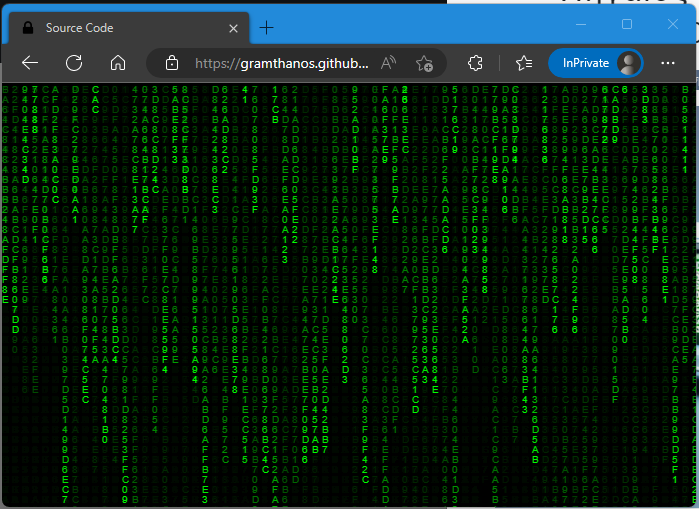
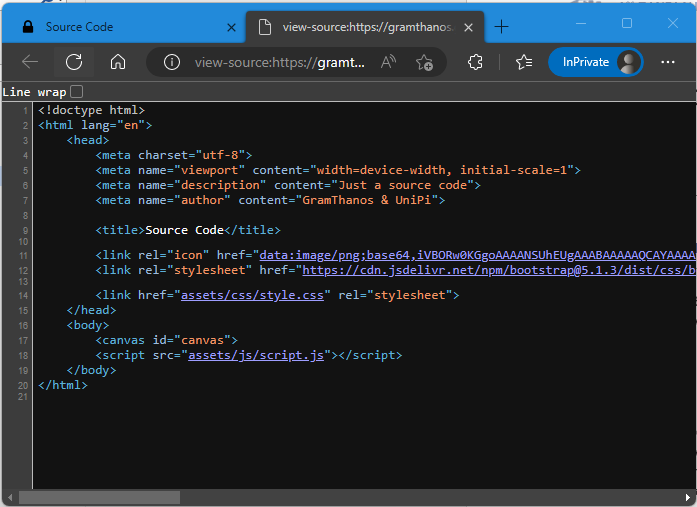
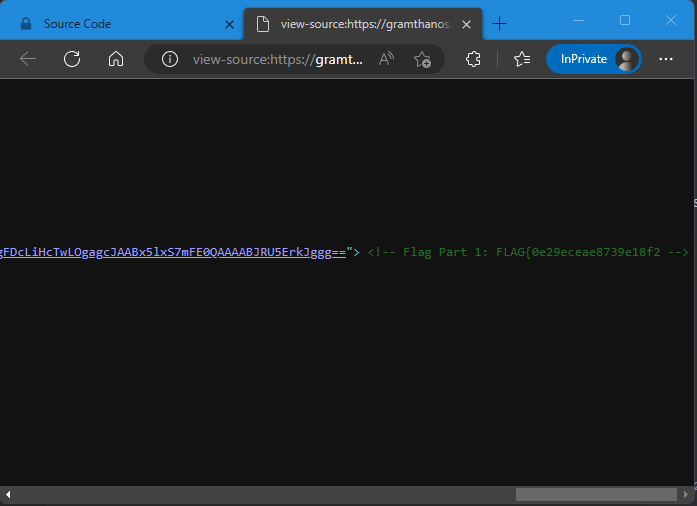
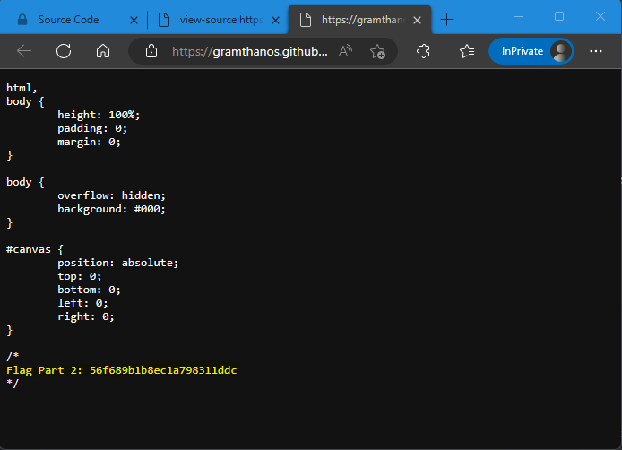
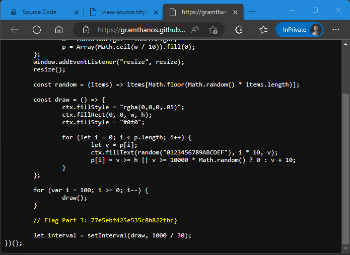

# Πηγαίος Κώδικας Write-Up


| Δοκιμασία | Πηγαίος Κώδικας |
| :------- | :----- |
| Δυσκολία | Εύκολη |
| Κατηγορία | Παγκόσμιος Ιστός (Web) |
| Λύσεις | 33 |
| Πόντοι | 200 |

## Επισκόπηση Δοκιμασίας

Στην εκφώνηση της δοκιμασίας μας δίνεται μια ιστοσελίδα, στην οποία μαθαίνουμε πως κρύβεται ένα μήνυμα. Καταλαβαίνουμε λοιπόν πως πρέπει να ψάξουμε την σελίδα για να βρούμε το μήνυμα αυτό.

Ανοίγοντας το link της σελίδας σε μια νέα καρτέλα βλέπουμε διάφορα πράσινα αλφαριθμητικά να πέφτουν (το οποίο θυμίζει λίγο την ταινία Matrix).



## Επίλυση
### Αρχική ανάλυση

Σαν πρώτη σκέψη όταν έχουμε μια ιστοσελίδα είναι να μάθουμε πως ακριβός δουλεύει η σελίδα αυτή. Μιας και ο τίτλος της δοκιμασίας είναι "πηγαίος κώδικας" μπορούμε για αρχή να δούμε τον πηγαίο κώδικα της σελίδας αυτής, τον οποίο έστειλε ο διακομιστής (server) της ιστοσελίδας στον περιηγητή τους διαδικτύου μας (web browser).

### Κυρίως επίλυση

Για να δούμε τον πηγαίο κώδικα μιας σελίδας, ο πιο εύκολος τρόπος είναι να κάνουμε δεξί κλικ στην σελίδα και να επιλέξουμε την αντίστοιχη επιλογή (συνήθως "προβολή πηγαίου κώδικα" ή "view page source"). Στην συγκεκριμένη σελίδα όμως όταν κάνουμε δεξί κλικ, η επιλογή αυτή δεν υπάρχει, αντίθετα μας εμφανίζετε ένα μενού που συνήθως εμφανίζετε όταν κάνουμε δεξί κλικ σε κάποια φωτογραφία. Για τον λόγο αυτόν, θα πρέπει να βρούμε έναν άλλο τρόπο να δούμε τον πηγαίο κώδικα.

Έχουμε λοιπόν 2 επιλογές. Η πρώτη είναι να βρούμε την επιλογή αυτή μέσα από το κυρίως μενού του περιηγητή, ή να χρησιμοποιήσουμε κάποια συντόμευση. Για περιηγητές διαδικτύου οι οποίοι είναι βασισμένοι το Chromium Project (π.χ. Google Chrome, Microsoft Edge) μπορούμε να χρησιμοποιήσουμε την συντόμευση `ctrl+u` για να ανοίξουμε τον πηγαίο κώδικα.



Διαβάζοντας τον κώδικα συναντάμε αρχικά στην HTML της κυρίως σελίδας το πρώτο κομμάτι του flag μέσα σε ένα HTML comment.


Συνεχίζοντας το ψάξιμο, και ανοίγοντας επιπλέον αρχεία της σελίδας, συναντάμε και ένα 2ο κομμάτι του flag στον κώδικα του CSS.


Τέλος, βρήκαμε και το τελευταίο κομμάτι του flag στον κώδικα της JavaScript.


### Εναλλακτική επίλυση

Μπορούμε να ψάξουμε τον κώδικα της σελίδας με την χρήση εργαλείων. Αυτό μπορεί να κάνει την διαδικασία πιο εύκολη σε περιπτώσεις που ο κώδικας της ιστοσελίδας είναι πολύ μεγάλος, ή ιστοσελίδα περιέχει μεγάλο αριθμό σελίδων που πρέπει να ψάξουμε.

Αρχικά μπορούμε να κατεβάσουμε την ιστοσελίδα τοπικά στον υπολογιστή μας. Για να το κάνουμε αυτό μπορούμε να χρησιμοποιήσουμε ένα Linux τερματικό (πχ μέσο Ubuntu VM ή μέσο Windows Subsystem for Linux), και να καλέσουμε την εντολή `wget` με τις κατάλληλες παραμέτρους για κατεβάσουμε μια ολόκληρη ιστοσελίδα. Παρακάτω δίνεται ένα παράδειγμα κλήσης αυτής της εντολής για το κατέβασμα της ιστοσελίδας της δοκιμασίας:
```cmd
thanos@banana:~/ wget --recursive --no-clobber --convert-links --restrict-file-names=windows --domains gramthanos.github.io --no-parent https://gramthanos.github.io/pmdk-2023-challenge-source-code/
```

Στην συνέχεια, μέσα από το ίδιο τερματικό, μπορούμε να χρησιμοποιήσουμε την εντολή `grep` για να αναζητήσουμε στους κώδικες της ιστοσελίδας κάποια λέξη κλειδί. Εκτελούμε λοιπόν μια αναζήτηση σε όλα τα αρχεία και όλους τους φακέλους που κατεβάσαμε ψάχνοντας την λέξη `flag` (μιας και ξέρουμε ότι οι σημαίες ξεκινούν με αυτήν την λέξη) χωρίς διάκριση πεζών-κεφαλαίων:
```cmd
thanos@banana:~/ grep -R -i "flag" .
./assets/css/style.css:Flag Part 2: 56f689b1b8ec1a798311ddc
./assets/js/script.js:     // Flag Part 3: 77e5ebf425e535c8b822fbc}
./index.html:              <link rel="icon" href="data:image/png;base64,iVBORw0KGgoAAAANSUhEUgAAABAAAAAQCAYAAAAf8/9hAAAACXBIWXMAAAsTAAALEwEAmpwYAAAAi0lEQVQ4jWNgoBEQBuIeID4Hxd1ALESsZnEgvgPE/4H4IxT/h4qJEWPAQqiGBiBmguJGqNg8Ygx4C8Q3gZgRSQzEvgXEb4gxAGTTdizi26FyeIEAVNEBIFZCwwegcgK4NAsC8VeoInz4K1QtBlAlQjMMqw5TA1RIMEAFmwGgFDcLiHcTwLOgagcJAABx5lxS7mFE0QAAAABJRU5ErkJggg=="> <!-- Flag Part 1: FLAG{0e29eceae8739e18f2 -->
```

Βλέπουμε πως με αυτόν τον τρόπο καταφέραμε να βρούμε όλα τα κομμάτια της σημαίας. Η μέθοδος αυτή αν και πιο γρήγορη όταν ψάχνουμε σε πολλά αρχεία, μπορεί να αποτύχει αν δεν ψάξουμε με τις κατάλληλες λέξεις. Για πιο περίπλοκες αναζητήσεις, μπορούμε να χρησιμοποιήσουμε και Regular Expressions αντί για λέξεις κλειδιά.

## Σημαία

Έχοντας συλλέξει τα παρακάτω κομμάτια της σημαίας:
```
Flag Part 1: FLAG{0e29eceae8739e18f2
Flag Part 2: 56f689b1b8ec1a798311ddc
Flag Part 3: 77e5ebf425e535c8b822fbc}
```

μπορούμε να ανακτήσουμε ολόκληρη την σημαία:
```
FLAG{0e29eceae8739e18f256f689b1b8ec1a798311ddc77e5ebf425e535c8b822fbc}
```
