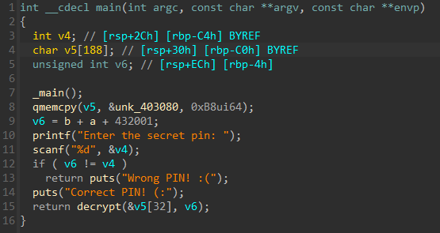
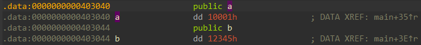
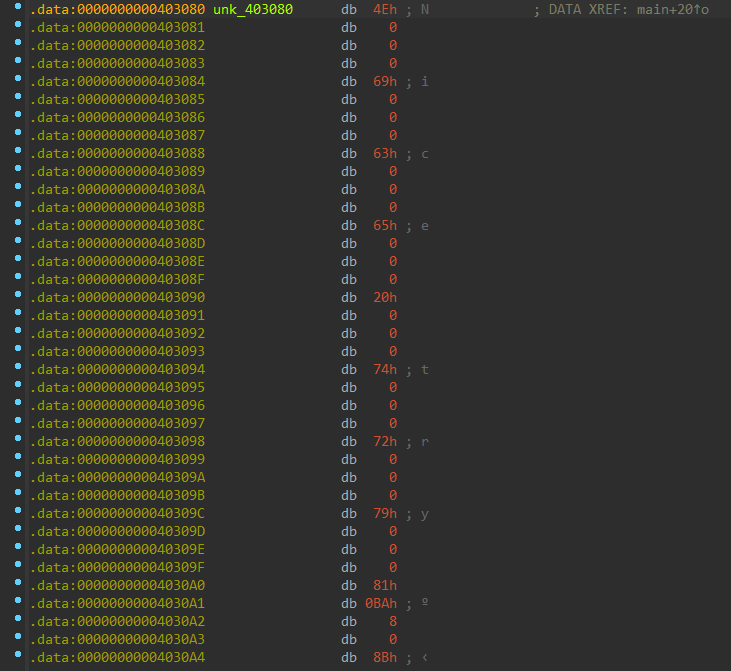
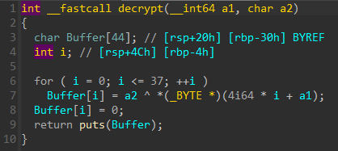
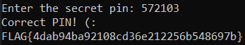

# Χαμένο Συνθηματικό Write-Up


| Δοκιμασία | Χαμένο Συνθηματικό |
| :------- | :----- |
| Δυσκολία | Εύκολη |
| Κατηγορία | Αντίστροφη Μηχανική (Reverse Engineering) |
| Λύσεις | 19 |
| Πόντοι | 276 |

## Περιγραφή Δοκιμασίας

Η περιγραφή της δοκιμασίας αναφέρει:
```
Προσπαθώ να τρέξω αυτήν την εφαρμογή αλλά έχω ξεχάσει το συνθηματικό της ... Μπορείς να με βοηθήσεις;
```

Επιπλέον μας δίνετε ένα zip αρχείο το οποίο μέσα περιέχει ένα εκτελέσιμο αρχείο για Windows. 

## Επίλυση
### Κυρίως επίλυση
Εκτελώντας το πρόγραμμα βλέπουμε ότι μας ζητάει ένα μυστικό PIN. Υποθέτουμε ότι αν δώσουμε το σωστό, θα μας εμφανίσει το flag.

Αν δώσουμε ένα λάθος pin μας εμφανίζεται το μήνυμα `Wrong PIN! :(`

Ανοίγουμε το πρόγραμμα στην IDA και μεταφερόμαστε κατευθείαν στην main συνάρτηση. Εκεί βλέπουμε τα μηνύματα που είδαμε όταν τρέξαμε το πρόγραμμα καθώς και μια συνάρτηση decrypt που πιθανώς θα είναι αυτή που αποκρυπτογραφεί το flag.



Το input μας αποθηκεύεται στο `v4` και συγκρίνεται στην πορεία με το `v6` το οποίο είναι ίσο με `b + a + 432001`. Μπορούμε να πατήσουμε πάνω στα `a`, `b` για να δούμε τι τιμή έχουν. Ουσιαστικά, το άθροισμα αυτό σχηματίζει το PIN που ψάχνουμε.



Επομένως `PIN = 0x10001 + 0x12345 + 432001 = 572103.`

Στην συνέχεια βλέπουμε ότι καλείται η συνάρτηση decrypt που παίρνει ως είσοδο το `v5` και το `v6` που είναι το PIN. Το `v5` από την γραμμή 8 καταλαβαίνουμε ότι είναι ένας πίνακας. Πατώντας πάνω στο `&unk_403080` μπορούμε να δούμε τις τιμές.



Μέσα στην decrypt βλέπουμε ότι κάθε τιμή του πίνακα αυτού, εκτός των πρώτων χαρακτήρων που σχηματίζουν το `Nice try` γίνονται XOR με το PIN και έτσι παράγεται το τελικό flag.
 


Παρ' όλα αυτά εμείς δεν χρειάζεται να κάνουμε decrypt γιατί αν δώσουμε το σωστό PIN μας εμφανίζεται κατευθείαν το flag στην οθόνη.



### Εναλλακτική επίλυση

Μπορούμε να γράψουμε την δικιά μας decrypt συνάρτηση. Παίρνουμε τα δεδομένα από την IDA κάνοντας highlight ολόκληρο τον πίνακα και στην συνέχεια πατώντας `Shift+E` κάνουμε export σαν array. 

Μετά φτιάχνουμε στην python ένα array με αυτές τις τιμές.

```python
enc = [78,   0,   0,   0, 105,   0,   0,   0,
       99,   0,   0,   0, 101,   0,   0,   0,
       32,   0,   0,   0, 116,   0,   0,   0,
      114,   0,   0,   0, 121,   0,   0,   0,
      129, 186,   8,   0, 139, 186,   8,   0, 
      134, 186,   8,   0, 128, 186,   8,   0,
      188, 186,   8,   0, 243, 186,   8,   0,
      163, 186,   8,   0, 166, 186,   8,   0,
      165, 186,   8,   0, 254, 186,   8,   0,
      243, 186,   8,   0, 165, 186,   8,   0, 
      166, 186,   8,   0, 254, 186,   8,   0,
      245, 186,   8,   0, 246, 186,   8,   0,
      247, 186,   8,   0, 255, 186,   8,   0,
      164, 186,   8,   0, 163, 186,   8,   0,
      244, 186,   8,   0, 241, 186,   8,   0, 
      162, 186,   8,   0, 245, 186,   8,   0,
      246, 186,   8,   0, 245, 186,   8,   0,
      245, 186,   8,   0, 242, 186,   8,   0,
      241, 186,   8,   0, 165, 186,   8,   0,
      242, 186,   8,   0, 243, 186,   8,   0, 
      255, 186,   8,   0, 241, 186,   8,   0,
      254, 186,   8,   0, 240, 186,   8,   0,
      165, 186,   8,   0, 186, 186,   8,   0]

for i in range(0, len(enc), 4):
  block = enc[i:i+4][::-1]  # reverse the block because data are stored in little endian in memory
  block = b''.join(bytes([b]) for b in block)
  block = bytes_to_long(block)
  print(chr(block^pin), end='')
print()
```

## Σημαία

```
FLAG{4dab94ba92108cd36e212256b548697b}
```
