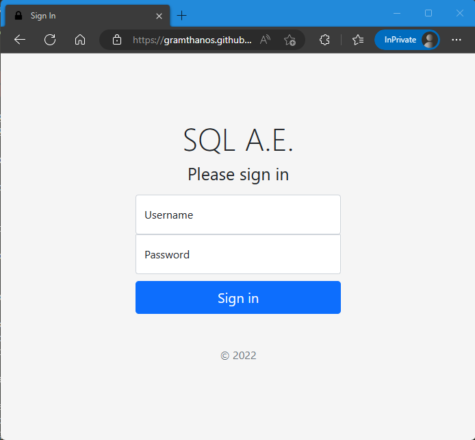
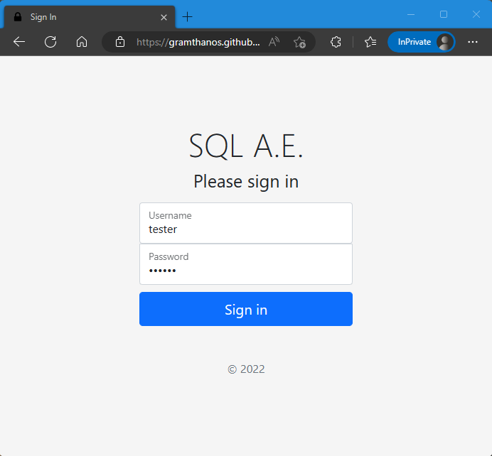
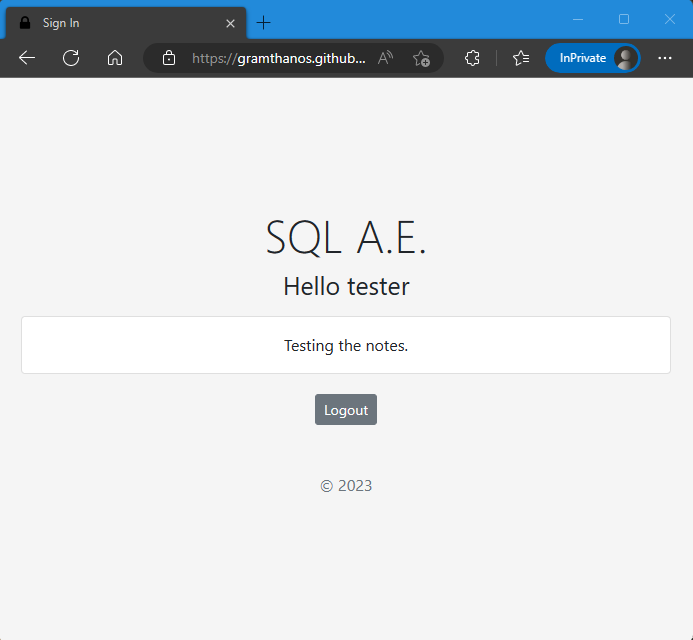
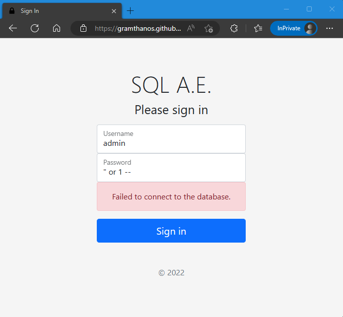
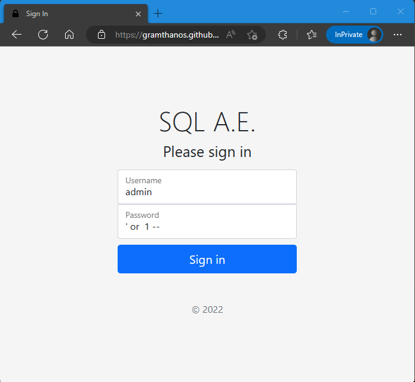

# SQL Ανώνυμη Εταιρεία Write-Up


| Δοκιμασία | SQL Ανώνυμη Εταιρεία |
| :------- | :----- |
| Δυσκολία | Εύκολη |
| Κατηγορία | Παγκόσμιος Ιστός (Web) |
| Λύσεις | 20 |
| Πόντοι | 239 |

## Επισκόπηση Δοκιμασίας

Στην εκφώνηση της δοκιμασίας μας δίνεται μια ιστοσελίδα, την οποία πρέπει να ελένξουμε για θέματα ασφαλείας. Η εκφώνηση μας δίνει και ένα δοκιμαστικό λογαριασμό με username `tester` και password `tester`.

Ανοίγοντας το link της σελίδας σε μια νέα καρτέλα βλέπουμε μια φόρμα σύνδεσης που ζητά username και password.



## Επίλυση
### Αρχική ανάλυση

Αρχικά δοκιμάζουμε να συνδεθούμε με τον δοκιμαστικό χρήστη που μας έδωσαν για να δούμε πως λειτουργεί η εφαρμογή:




Η εφαρμογή φαίνεται αρκετά απλή.

### Κυρίως επίλυση

Ο τίτλος της δοκιμασίας είναι το πρώτο στοιχείο που έχουμε το οποίο μάλλον υπονοεί πως η ιστοσελίδα χρησιμοποιεί SQL για την σύνδεση με την βάση δεδομένων της οπότε και για την αυθεντικοποίηση των χρηστών. Το πρώτο πράγμα του σκεφτόμαστε είναι να χρησιμοποιήσουμε SQL injection για να παρακάμψουμε την αυθεντικοποίηση.

Στην επίθεση αυτήν, υποθέτουμε το SQL query που μπορεί να χρησιμοποιεί η σελίδα και προσπαθούμε να το αλλάξουμε. Υποθέτουμε λοιπόν πως το SQL query είναι:
```sql
SELECT * FROM users WHERE username = "userA" AND password = "passwordB";
```
όπου `userA` είναι το αλφαριθμητικό που δώσαμε στο πεδίο username και `passwordB` είναι το αλφαριθμητικό που δώσαμε στο πεδίο password.

Για να εκτελέσουμε την επίθεση, μπορούμε να αλλάξουμε την 2η συνθήκη (`password = "passwordB"`) έτσι ώστε να είναι πάντα αληθής. Για να το κάνουμε αυτό μπορούμε να δώσουμε σαν κωδικό στο πεδίο password το `" or 1 = 1 or "invalid" = "` μετατρέποντας το SQL query σε:
```sql
SELECT * FROM users WHERE username = "userA" AND password = "" or 1 = 1 or "invalid" = "";
```
οπότε τώρα το `1 = 1` γυρίζει πάντα `TRUE` οπότε και παρακάμπτετε ο έλεγχος για τον κωδικό του χρήστη.


Υποθέτοντας λοιπόν πως υπάρχει ένας χρήστης με το username `admin`, κάνουμε SQL injection στον κωδικό του δίνοντας `" or 1 --` (το `--` σηματοδοτεί την αρχή ενός comment στον κώδικα οπότε και κάνει την SQL να αγνοήσει το υπόλοιπο κομμάτι του κώδικα, ενώ το `1` από μόνο σαν λογική έκφραση ισοδυναμεί με το `TRUE`). Το SQL query που υποθέσαμε θα διαμορφωθεί ως:
```sql
SELECT * FROM users WHERE username = "admin" AND password = "" or 1 --";
```


Η πρώτη μας προσπάθειά απέτυχε, το οποίο σημαίνει πως είτε η εφαρμογή δεν είναι ευάλωτη σε SQL injection ή ότι η υπόθεσή μας για το SQL query είναι λάθος. Συνεχίζοντας λοιπόν κάνουμε μια 2η υπόθεση, ότι στο SQL query αντί για `"` έχουμε `'`. Βάση της νέας υπόθεσή μας λοιπόν, το SQL query είναι:
```sql
SELECT * FROM users WHERE username = 'userA' AND password = 'passwordB';
```

Αλλάζουμε λοιπόν την επίθεσή μας σε username `admin` και password `' or 1 --`




## Σημαία

```
FLAG{5ae1b4f4b20a95bbd5a20e73ef42c396bde4a09cf9921ab9f866ed4a0c1680f9}
```
