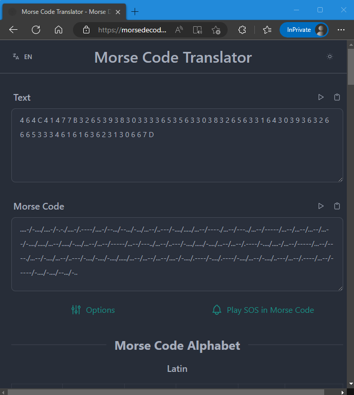

# QR και κώδικες Write-Up


| Δοκιμασία | QR και κώδικες |
| :------- | :----- |
| Δυσκολία | Εύκολη |
| Κατηγορία | Διάφορα (Misc) |
| Λύσεις | 28 |
| Πόντοι | 200 |

## Επισκόπηση Δοκιμασίας

### Περιγραφή
Η περιγραφή της  δοκιμασίας αναφέρει:
```
Προσπαθώ να σαρώσω αυτό τον κωδικό QR αλλά δεν δουλεύει. Σε εσένα δουλεύει;
```
Ενώ παράλληλα μας δίνεται ένα zip αρχείο με μια εικόνα που φαίνεται να είναι ένα QR code:


## Επίλυση

Σαν πρώτο βήμα δοκιμάζουμε να αποκωδικοποιήσουμε την φωτογραφία ως QR code με την χρήση κάποια εφαρμογής. Κάνοντας χρήση της web εφαρμογής [ZXing Decoder Online](https://zxing.org/) αποκωδικοποιήσαμε την φωτογραφία.


Λαμβάνοντας σαν έξοδο το κείμενο:
```
....-/-..../....-/-.-./....-/.----/....-/--.../--.../-.../...--/..---/-..../...../...--/----./...--/---../...--/-----/...--/...--/...--/...--/-..../...../...--/...../-..../...--/...--/-----/...--/---../...--/..---/-..../...../-..../...--/...--/.----/-..../....-/...--/-----/...--/----./...--/-..../...--/..---/-..../-..../-..../...../...--/...--/...--/....-/-..../.----/-..../.----/-..../...--/-..../..---/...--/.----/...--/-----/-..../-..../--.../-..
```

Μιας και το κείμενο χρησιμοποιεί κατά κύριο λόγο τελείες και παύλες, φαίνεται πως είναι κάποιο μήνυμα κωδικοποιημένο σε [κώδικα μορς (Morse Code)](https://en.wikipedia.org/wiki/Morse_code).

Κάνοντας την αποκωδικοποίηση με το χέρι η χρησιμοποιώντας και πάλι μια web εφαρμογή (πχ το ["Morse Code Translator"](https://morsedecoder.com/)) λαμβάνουμε το αλφαριθμητικό:
```
4 6 4 C 4 1 4 7 7 B 3 2 6 5 3 9 3 8 3 0 3 3 3 3 6 5 3 5 6 3 3 0 3 8 3 2 6 5 6 3 3 1 6 4 3 0 3 9 3 6 3 2 6 6 6 5 3 3 3 4 6 1 6 1 6 3 6 2 3 1 3 0 6 6 7 D
```



Παρατηρούμε πως το αλφαριθμητικό αυτό περιέχει μόνο αριθμούς και χαρακτήρες από το B έως το D, οπότε θα μπορούσε να είναι κάποιο μήνυμα σε δεκαεξαδικό (μιας και για την αναπαράσταση στο δεκαεξαδικό σύστημα χρησιμοποιούμε μόνο τα σύμβολα `0,1,2,3,4,5,6,7,8,9,A,B,C,D,E,F`). Χωρίζουμε λοιπόν το μήνυμα σε δυάδες και έχουμε:
```
46 4C 41 47 7B 32 65 39 38 30 33 33 65 35 63 30 38 32 65 63 31 64 30 39 36 32 66 65 33 34 61 61 63 62 31 30 66 7D
```

Τώρα μπορούμε να το αποκωδικοποιήσουμε βάση του πίνακα ASCII που αντιστοιχεί αριθμούς σε χαρακτήρες. Και πάλι μπορούμε να το κάνουμε είτε με το χέρι είτε με την χρήση κάποιας εφαρμογής (πχ. με το [Hex to ASCII Text String Converter](https://www.rapidtables.com/convert/number/hex-to-ascii.html)):


## Σημαία

```
FLAG{2e98033e5c082ec1d0962fe34aacb10f}
```
