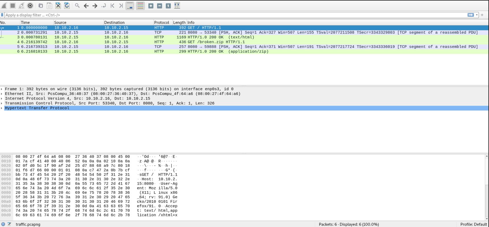
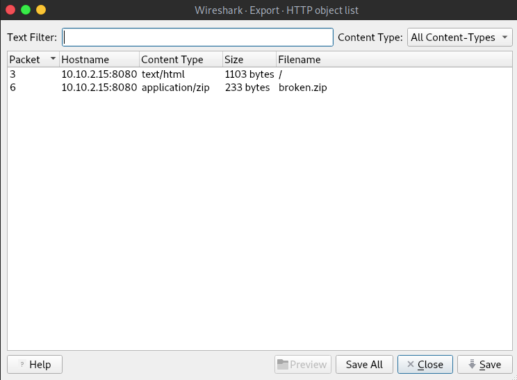
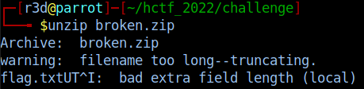
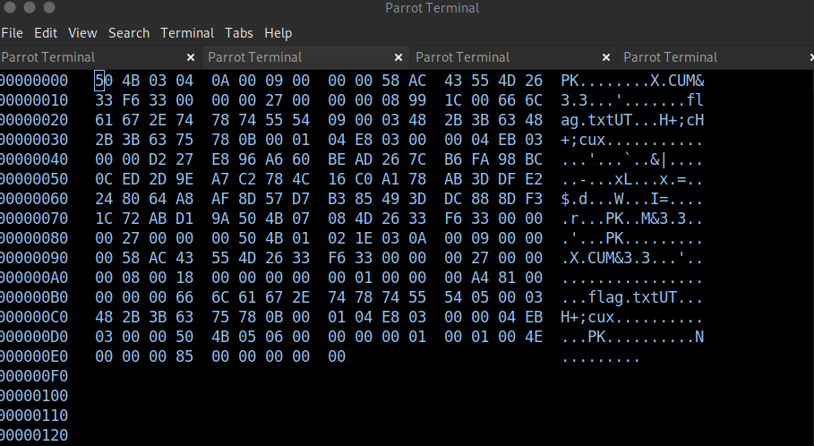
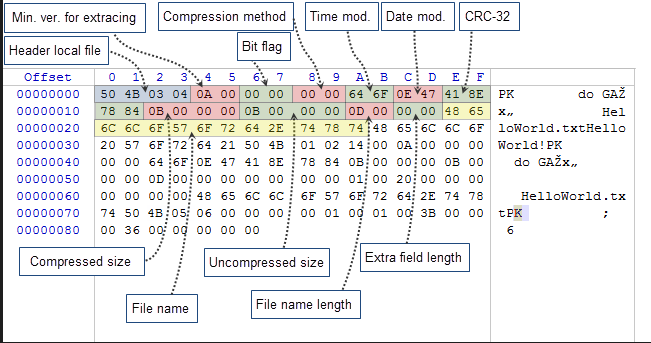
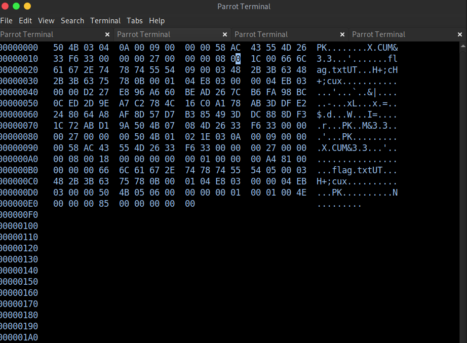
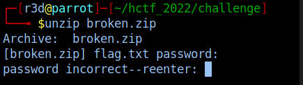
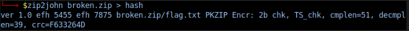
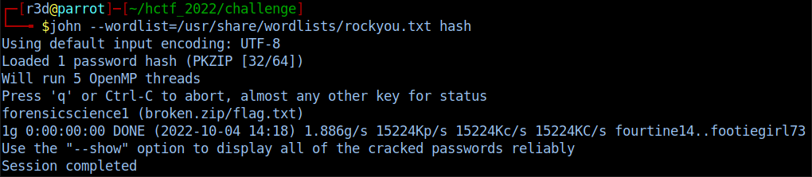
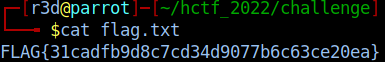

# Ανάλυση ροής πακέτων Write-Up


| Δοκιμασία | Ανάλυση ροής πακέτων |
| :------- | :----- |
| Δυσκολία | Μέτρια |
| Κατηγορία | Ψηφιακή Εγκληματολογία (Forensics) |
| Λύσεις | 8 |
| Πόντοι | 551 |

## Περιγραφή Δοκιμασίας

Η περιγραφή της δοκιμασίας μας αναφέρει:
```
Μάθαμε πως κάποιος υπάλληλος της εταιρίας μας διέρρευσε παράνομα ένα αρχείο με αρχεία πελατών μας. Η υπόθεση είναι υπό διερεύνηση και θέλουμε την βοήθειά σου για να δούμε τι αρχεία διέρρευσαν. Παρακαλώ κάνε μια ανάλυση σε αυτήν την ύποπτη διαδικτυακή ροή δεδομένων. Το μόνο που μπορέσαμε να μάθουμε είναι ότι μέσα κρύβεται το flag.txt αρχείο.
```
Παράλληλα μας δίνεται ένα αρχείο `zip` το οποίο περιέχει ένα αρχείο `traffix.pcapng`.


## Επίλυση

Μπορούμε να ανοίξουμε τα αρχεία τύπου `pcapng` με το πρόγραμμα ανάλυσης πακέτων [Wireshark](https://www.wireshark.org/).

Αναλύοντας την ροή πακέτων στο Wireshark, βλέπουμε πως έγινε μια επίσκεψη σε μια σελίδα στο διαδίκτυο (μέσο του πρωτοκόλλου HTTP) στην οποία ο χρήστης κατέβασε από τον διακομιστή ένα αρχείο zip.



Ας ρίξουμε μια ματιά στο αρχείο που κατέβασε ο χρήστης. Για να το κάνουμε αυτό, μπορούμε να επιλέξουμε από το μενού `File > Export objects > HTTP `:



Βρήκαμε ένα αρχείο με το όνομα `broken.zip`, το οποίο μπορούμε να επιλέξουμε και να το αποθηκεύσουμε κάνοντας κλικ στο κουμπί `save`.

Στην συνέχεια μπορούμε να προσπαθήσουμε να το αποσυμπιέσουμε για να δούμε τα περιεχόμενά του... αλλά:



Η προειδοποίηση `filename too long` μας υποδεικνύει πως κάτι έχει καταστραφεί τις επικεφαλίδες του αρχείου (στην δομή των bytes του του αρχείου).

Με την χρήση του εργαλείου `hexedit` μπορούμε να επιθεωρήσουμε τα bytes της επικεφαλίδας και να προσπαθήσουμε να τις διορθώσουμε.



Η επόμενη ενέργεια μας είναι να βρούμε τις κατάλληλες επικεφαλίδες για ένα αρχείο τύπου `zip`.

Στην παρακάτω φωτογραφία ([πηγή](https://www.mql5.com/en/articles/1971)) φαίνεται η δομή των bytes της επικεφαλίδας των zip αρχείων.



Αφού τα συγκρίναμε με το bytes που είχε το δικό μας αρχείο, ανακαλύψαμε πως στη γραμμή `0x000000010` και στη στήλη `0xB` (τμήμα μήκους ονόματος αρχείου) αντί για `0x00` η τιμή μας ήταν `0x99`. Γνωρίζουμε ότι το αρχείο .zip περιέχει το αρχείο `flag.txt`, του οποίου το όνομα είναι 8 χαρακτήρες άρα 8 byte, επομένως η στήλη 0xA είναι σωστή, αλλά η προσθήκη `0x99` byte στο "File name length" κατέστρεφε το αρχείο `zip`.

Με την χρήση ξανά του `hexedit` μπορέσαμε να αλλάξουμε την τιμή `0x99` σε `0x00`.




Προσπαθήσαμε να αποσυμπιέσουμε το αρχείο `broken.zip` και πάλι. Αν και αυτήν την φορά η εντολή δεν πέταξε κάποιο σφάλμα, είδαμε πως το αρχείο ήταν προστατευμένο με κωδικό πρόσβασης.

Ψάξαμε για περισσότερες πληροφορίες στο αρχείο `traffic.pcapng`, αλλά δεν βρήκαμε τίποτα ενδιαφέρον.



Η επόμενη σκέψη μας ήταν να χρησιμοποιήσουμε το `john the ripper` για να σπάσουμε τον κωδικό. Εκτελέσαμε λοιπόν πρώτα το `zip2john` για να πάρουμε την τιμή hash του κωδικού που έπρεπε να σπάσουμε και στη συνέχεια καλέσαμε το `john the ripper`.




Σπάμε τον κωδικό πρόσβασης που ήταν: `forensicscience1`

Το τελευταίο πράγμα ήταν απλώς να εισάγουμε τον κωδικό πρόσβασης και τελικά το αρχείο `zip` αποσυμπιέστηκε και μπορέσαμε να πάρουμε τη σημαία και να λύσουμε την πρόκληση.




## Σημαία

```
FLAG{31cadfb9d8c7cd34d9077b6c63ce20ea}
```
