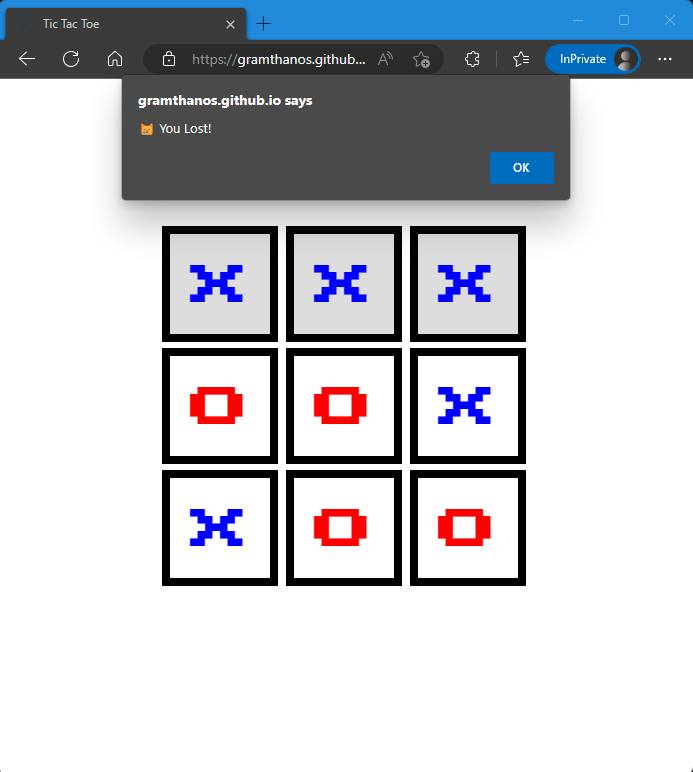
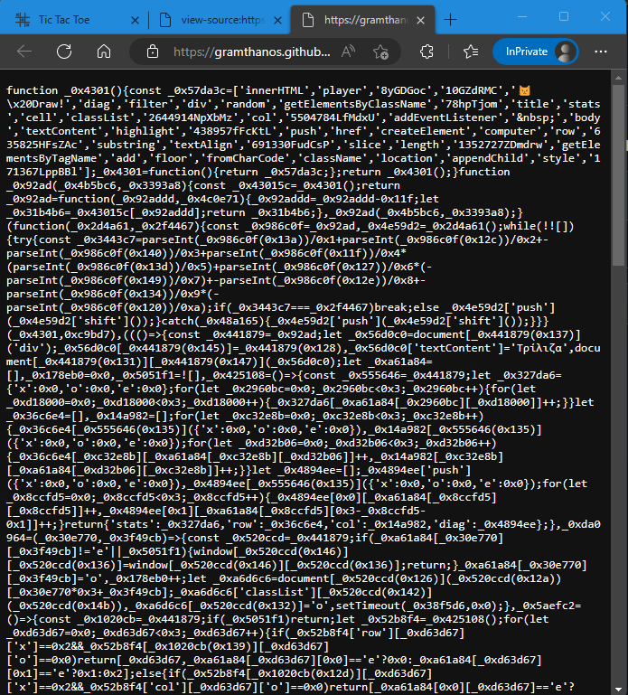
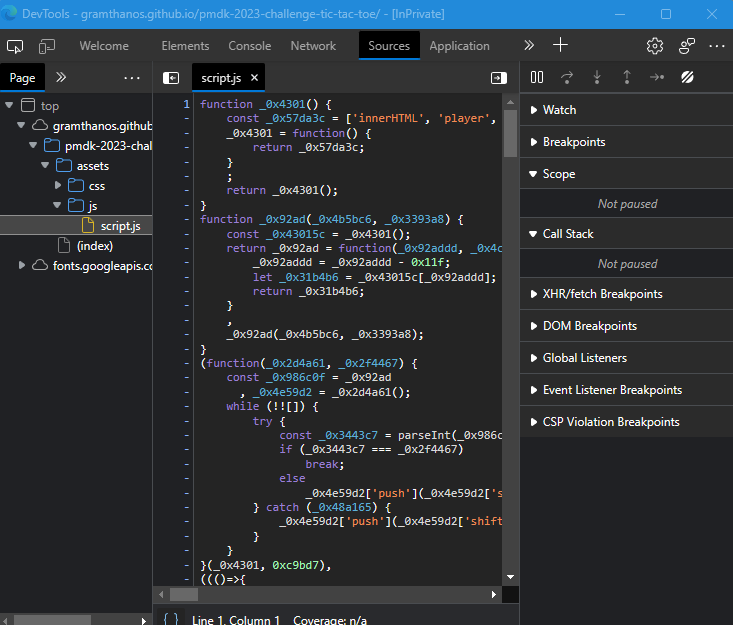
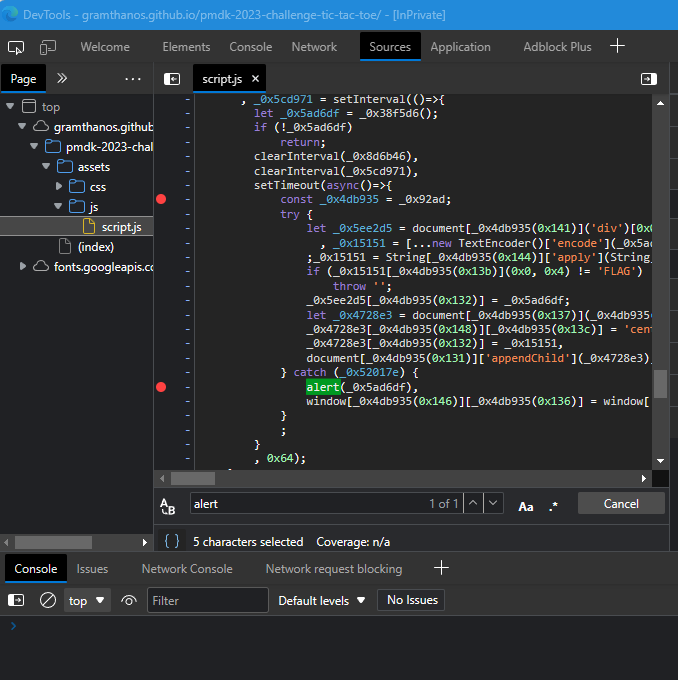
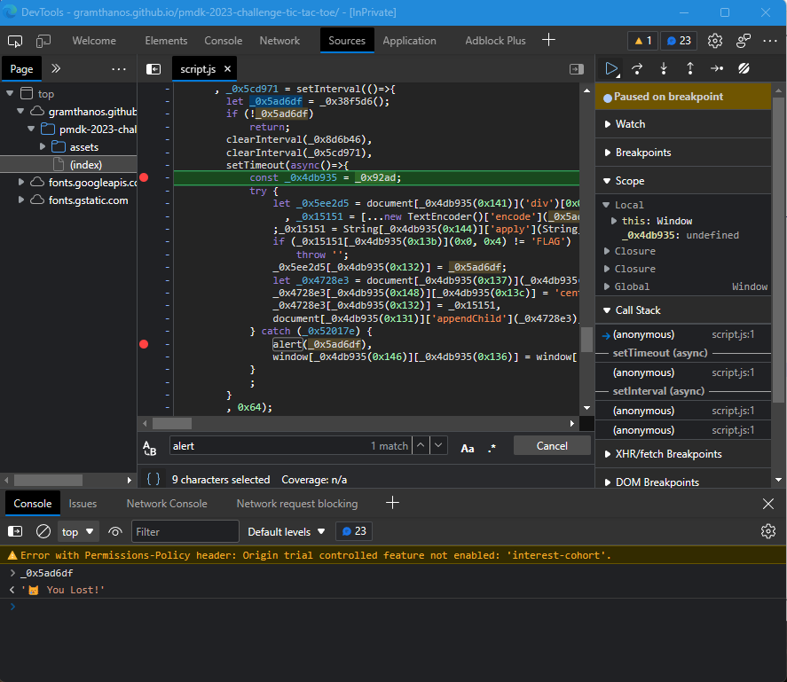
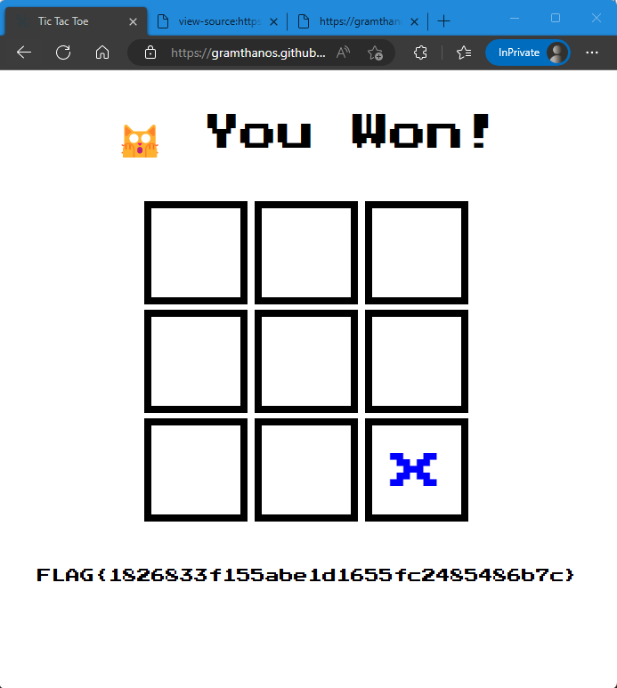

# Τρίλιζα Write-Up


| Δοκιμασία | Τρίλιζα |
| :------- | :----- |
| Δυσκολία | Μέτρια |
| Κατηγορία | Διάφορα (Misc) / Παγκόσμιος Ιστός (Web) |
| Λύσεις | 19 |
| Πόντοι | 276 |

## Επισκόπηση Δοκιμασίας

Στην εκφώνηση της δοκιμασίας μας δίνεται μια ιστοσελίδα, στην οποία τρέχει ένα παιχνίδι τρίλιζας, το οποίο πρέπει να νικήσουμε.

Στο παιχνίδι παίζουμε ενάντια στον υπολογιστή ο οποίος παίζει το τέλειο παιχνίδι τρίλιζας και δεν μας αφήνει να νικήσουμε.



## Επίλυση

Για να καταφέρουμε να νικήσουμε το παιχνίδι πρέπει αντί να παίξουμε μέσω της διεπαφής στη ιστοσελίδας, να πειράξουμε τον κώδικα του παιχνιδιού και να κλέψουμε.

Για να το κάνουμε αυτό, αρχικά ανοίγουμε τον κώδικα της σελίδας και κοιτάμε το αρχείο JavaScript που περιέχει και έχει μέσα τον κώδικα του παιχνιδιού.

Παρατηρούμε όμως πως ο κώδικας αυτός είναι obfuscated με αποτέλεσμα να μην διαβάζετε εύκολα και να είναι πολύ δυσνόητος.


Ανοίγουμε λοιπόν τον κώδικα και μέσω των developer tools του περιηγητή της ιστοσελίδας, μέσο των οποίων μπορούμε και να αποτελματώσουμε τον κώδικα. Για να το κάνουμε αυτό, κάνουμε δεξί κλικ στην σελίδα, επιλέγουμε "inspect element", στην συνέχεια στο πάνελ που ανοίγει πάμε στην καρτέλα "Sources" και ανοίγουμε το αρχείο "script.js" της σελίδας το οποίο περιέχει τον κώδικα του παιχνιδιού. Στο κάτω μέρος του κώδικα, τα εργαλεία προγραμματιστή μας δίνουν και ένα κουμπί για να κάνουν beautify τον κώδικα (το κουμπί με την ένδειξη "{ }") έτσι ώστε να διαβάζετε πιο εύκολα. 



Αφού όταν το παιχνίδι τελειώνει εμφανίζετε ένα μήνυμα τύπου `alert` ψάχνουμε στον κώδικα το την κλήση αυτού του μηνύματος για να βρούμε την συνάρτηση που ελέγχει αν νικήσαμε ή χάσαμε το παιχνίδι. Αφού βρούμε την κλήση της `alert`, κάνοντας κλικ δίπλα στα αριστερά των γραμμών που θέλουμε, βάζουμε μερικά breakpoint που θα σταματήσουν την εκτέλεση του κώδικα και θα μας επιτρέψουν να δούμε τις μεταβλητές που θέλουμε για να καταλάβουμε πως δουλεύει ο κώδικα αυτός



Τώρα παίζουμε το παιχνίδι μέχρι να χάσουμε και να σταματήσει ο κώδικας στα breakpoints που έχουμε βάλει. Μπορούμε να χρησιμοποιήσουμε την κονσόλα για να εκτυπώσουμε μεταβλητές από το σημείο που σταμάτησε ο κώδικα ή για να τους αλλάξουμε την τιμή.



Παρατηρούμε πως ο κώδικας έχει ήδη καταλάβει ότι χάσαμε πως μέσα στην μεταβλητή `_0x5ad6df` έχει αποθηκευτεί το μήνυμα `😿 You Lost!`.

Δοκιμάζουμε να δούμε τι θα γίνει αν αλλάξουμε το μήνυμα στο μήνυμα νίκης (μπορούμε να βρούμε το μήνυμα νίκης λίγο πιο πάνω στον κώδικα):
```
_0x5ad6df = '🙀\x20You\x20Won!'
```
και στην συνέχεια πατάμε να συνεχίσει η εκτέλεση του κώδικα και... νικήσαμε!

Θα μπορούσαμε να σταματήσουμε εδώ, μια και πήραμε το flag, αλλά για να δούμε και λίγο παρακάτω, που κατάλαβε ο κώδικας πως χάσαμε;

Η μεταβλητή `_0x5ad6df` πήρε τιμή από την συνάρτηση `_0x38f5d6`. Ψάχνοντας αυτήν την συνάρτηση με το όνομά της, βρίσκουμε τον κώδικα:

```javascript
_0x38f5d6 = ()=>{
    const _0x36b2f0 = _0x441879;
    let _0x4d82db = _0x425108();
    if (_0x4d82db[_0x36b2f0(0x139)][0x0]['x'] == 0x3 || _0x4d82db['row'][0x1]['x'] == 0x3 || _0x4d82db[_0x36b2f0(0x139)][0x2]['x'] == 0x3 || _0x4d82db['col'][0x0]['x'] == 0x3 || _0x4d82db[_0x36b2f0(0x12d)][0x1]['x'] == 0x3 || _0x4d82db[_0x36b2f0(0x12d)][0x2]['x'] == 0x3 || _0x4d82db[_0x36b2f0(0x122)][0x0]['x'] == 0x3 || _0x4d82db['diag'][0x1]['x'] == 0x3)
        return _0x5051f1 = !![],
        _0x219fd9(_0x4d82db, 'x'),
        '😿\x20You\x20Lost!';
    if (_0x4d82db[_0x36b2f0(0x139)][0x0]['o'] == 0x3 || _0x4d82db[_0x36b2f0(0x139)][0x1]['o'] == 0x3 || _0x4d82db[_0x36b2f0(0x139)][0x2]['o'] == 0x3 || _0x4d82db[_0x36b2f0(0x12d)][0x0]['o'] == 0x3 || _0x4d82db[_0x36b2f0(0x12d)][0x1]['o'] == 0x3 || _0x4d82db[_0x36b2f0(0x12d)][0x2]['o'] == 0x3 || _0x4d82db[_0x36b2f0(0x122)][0x0]['o'] == 0x3 || _0x4d82db[_0x36b2f0(0x122)][0x1]['o'] == 0x3)
        return _0x5051f1 = !![],
        _0x219fd9(_0x4d82db, 'o'),
        '🙀\x20You\x20Won!';
    if (_0x4d82db[_0x36b2f0(0x129)]['e'] == 0x0 || _0x4d82db[_0x36b2f0(0x139)][0x0]['x'] > 0x0 && _0x4d82db['row'][0x0]['o'] > 0x0 && _0x4d82db[_0x36b2f0(0x139)][0x1]['x'] > 0x0 && _0x4d82db[_0x36b2f0(0x139)][0x1]['o'] > 0x0 && _0x4d82db[_0x36b2f0(0x139)][0x2]['x'] > 0x0 && _0x4d82db[_0x36b2f0(0x139)][0x2]['o'] > 0x0 && _0x4d82db[_0x36b2f0(0x12d)][0x0]['x'] > 0x0 && _0x4d82db[_0x36b2f0(0x12d)][0x0]['o'] > 0x0 && _0x4d82db[_0x36b2f0(0x12d)][0x1]['x'] > 0x0 && _0x4d82db[_0x36b2f0(0x12d)][0x1]['o'] > 0x0 && _0x4d82db[_0x36b2f0(0x12d)][0x2]['x'] > 0x0 && _0x4d82db[_0x36b2f0(0x12d)][0x2]['o'] > 0x0 && _0x4d82db[_0x36b2f0(0x122)][0x0]['x'] > 0x0 && _0x4d82db[_0x36b2f0(0x122)][0x0]['o'] > 0x0 && _0x4d82db['diag'][0x1]['x'] > 0x0 && _0x4d82db[_0x36b2f0(0x122)][0x1]['o'] > 0x0)
        return _0x5051f1 = !![],
        _0x36b2f0(0x121);
    return ![];
}
```

Την οποία μπορούμε να την αλλάξουμε λίγο προς όφελός μας:

```javascript
_0x38f5d6 = ()=>{
    const _0x36b2f0 = _0x441879;
    let _0x4d82db = _0x425108();
    //if (_0x4d82db[_0x36b2f0(0x139)][0x0]['x'] == 0x3 || _0x4d82db['row'][0x1]['x'] == 0x3 || _0x4d82db[_0x36b2f0(0x139)][0x2]['x'] == 0x3 || _0x4d82db['col'][0x0]['x'] == 0x3 || _0x4d82db[_0x36b2f0(0x12d)][0x1]['x'] == 0x3 || _0x4d82db[_0x36b2f0(0x12d)][0x2]['x'] == 0x3 || _0x4d82db[_0x36b2f0(0x122)][0x0]['x'] == 0x3 || _0x4d82db['diag'][0x1]['x'] == 0x3)
    if (false)
      return _0x5051f1 = !![],
        _0x219fd9(_0x4d82db, 'x'),
        '😿\x20You\x20Lost!';
    //if (_0x4d82db[_0x36b2f0(0x139)][0x0]['o'] == 0x3 || _0x4d82db[_0x36b2f0(0x139)][0x1]['o'] == 0x3 || _0x4d82db[_0x36b2f0(0x139)][0x2]['o'] == 0x3 || _0x4d82db[_0x36b2f0(0x12d)][0x0]['o'] == 0x3 || _0x4d82db[_0x36b2f0(0x12d)][0x1]['o'] == 0x3 || _0x4d82db[_0x36b2f0(0x12d)][0x2]['o'] == 0x3 || _0x4d82db[_0x36b2f0(0x122)][0x0]['o'] == 0x3 || _0x4d82db[_0x36b2f0(0x122)][0x1]['o'] == 0x3)
    if (true)
      return _0x5051f1 = !![],
        _0x219fd9(_0x4d82db, 'o'),
        '🙀\x20You\x20Won!';
    if (_0x4d82db[_0x36b2f0(0x129)]['e'] == 0x0 || _0x4d82db[_0x36b2f0(0x139)][0x0]['x'] > 0x0 && _0x4d82db['row'][0x0]['o'] > 0x0 && _0x4d82db[_0x36b2f0(0x139)][0x1]['x'] > 0x0 && _0x4d82db[_0x36b2f0(0x139)][0x1]['o'] > 0x0 && _0x4d82db[_0x36b2f0(0x139)][0x2]['x'] > 0x0 && _0x4d82db[_0x36b2f0(0x139)][0x2]['o'] > 0x0 && _0x4d82db[_0x36b2f0(0x12d)][0x0]['x'] > 0x0 && _0x4d82db[_0x36b2f0(0x12d)][0x0]['o'] > 0x0 && _0x4d82db[_0x36b2f0(0x12d)][0x1]['x'] > 0x0 && _0x4d82db[_0x36b2f0(0x12d)][0x1]['o'] > 0x0 && _0x4d82db[_0x36b2f0(0x12d)][0x2]['x'] > 0x0 && _0x4d82db[_0x36b2f0(0x12d)][0x2]['o'] > 0x0 && _0x4d82db[_0x36b2f0(0x122)][0x0]['x'] > 0x0 && _0x4d82db[_0x36b2f0(0x122)][0x0]['o'] > 0x0 && _0x4d82db['diag'][0x1]['x'] > 0x0 && _0x4d82db[_0x36b2f0(0x122)][0x1]['o'] > 0x0)
        return _0x5051f1 = !![],
        _0x36b2f0(0x121);
    return ![];
}
```
Τώρα σταματώντας τον κώδικα με ένα breakpoint αμέσως μετά τον ορισμό της συνάρτησης, και εισάγοντας τον νέο κώδικα στην κονσόλα, μπορούμε να αλλάξουμε την συνάρτηση. Συνεχίζοντας την εκτέλεση του κώδικα, νικάμε χωρίς καν να παίξουμε!



## Σημαία

```
FLAG{1826833f155abe1d1655fc2485486b7c}
```
