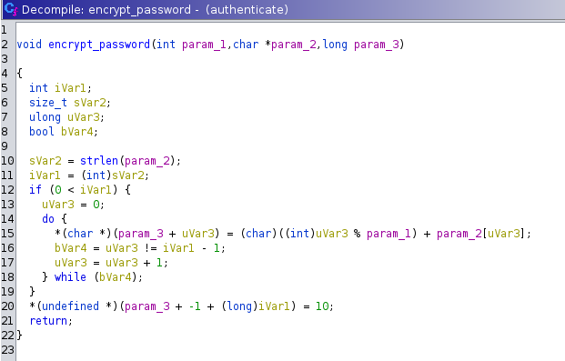

# Κρυπτογραφημένο συνθηματικό Write-Up


| Δοκιμασία | Κρυπτογραφημένο συνθηματικό |
| :------- | :----- |
| Δυσκολία | Μέτρια |
| Κατηγορία | Αντίστροφη Μηχανική (Reverse Engineering) |
| Λύσεις | 6 |
| Πόντοι | 575 |

## Εκφώνιση Δοκιμασίας

Από την εκφώνιση της δοκιμασίας καταλαβαίνουμε πως πρέπει να βρούμε τον κωδικό του χρήστη.
```
Κάποιος κρυπτογράφησε το συνθηματικό μου. Μήπως έχεις καμία ιδέα πώς να το πάρω πίσω;
```

Μας δίνεται ένα `zip` με μέσα ένα εκτελέσιμο αρχείο για Linux λειτουργικό.

## Επίλυση

Αρχικά τρέχουμε τo εκτελέσιμο για να δούμε τι ακριβώς κάνει. Μας ζήτησε ένα username και ένα password και μετά μας πέταξε ένα error πως δεν υπάρχει ο χρήστης.

```
thanos@banana:~$ ./authenticate
-= Please authenticate =-
username: thanos
password: thanos
Error! Unknown user.
```

Σαν δεύτερο βήμα, ανοίγουμε το [Ghidra](https://ghidra-sre.org/) και το αφήνουμε να αναλύσει την εφαρμογή. Αφού τελειώσει, βρίσκουμε από το μενού στα αριστερά την συνάρτηση main από την οποία και ξεκινά η εκτέλεση του προγράμματος.


```c

int main(void)

{
  int iVar1;
  long in_FS_OFFSET;
  int local_328;
  short local_324;
  char local_322;
  char local_228 [256];
  char local_128 [264];
  long local_20;
  
  local_20 = *(long *)(in_FS_OFFSET + 0x28);
  puts("-= Please authenticate =-");
  ___printf_chk(1,"username: ");
  fflush((FILE *)_IO_2_1_stdout_);
  fgets((char *)&local_328,0xff,(FILE *)_IO_2_1_stdin_);
  ___printf_chk(1,"password: ");
  fflush((FILE *)_IO_2_1_stdout_);
  fgets(local_228,0xff,(FILE *)_IO_2_1_stdin_);
  if (((local_328 == 0x696d6461) && (local_324 == 0xa6e)) && (local_322 == '\0')) {
    encrypt_password(5,local_228,local_128);
    iVar1 = strcmp(local_128,"mzavXr1pJcp5uv[osF\n");
    if (iVar1 == 0) {
      puts("Successful authentication!");
      putchar(10);
      print_flag(&local_328,local_228);
    }
    else {
      iVar1 = 1;
      puts("Error! Incorrect password.");
    }
  }
  else {
    iVar1 = 1;
    puts("Error! Unknown user.");
  }
  if (local_20 == *(long *)(in_FS_OFFSET + 0x28)) {
    return iVar1;
  }
                    /* WARNING: Subroutine does not return */
  __stack_chk_fail();
}
```

Παρατηρούμε στον C κώδικα που μας έδωσε το Ghidra ότι το πρόγραμμα στην γραμμή 18 διαβάζει την τιμή του που του δίνουμε από την κονσόλα και το βάζει στην μεταβλητή `local_328` η οποία έχει μέγεθος 1 char (ότι επιπλέον δώσουμε λογικά γράφετε στις επόμενες μεταβλητές που είναι στην σειρά στην μνήμη).

Οπότε αν δώσουμε σαν είσοδο στο όνομα "thanos", αυτό αντίστοιχα θα αποθηκευτεί στις μεταβλητές:
```c
int local_328; // than (4 bytes)
short local_324; // no (2 bytes)
char local_322; // s (1 byte)
```

Στην συνέχεια στην γραμμή 22 βλέπουμε πως αυτές οι μεταβλητές συγκρίνονται με κάποιες σταθερές τιμές:
```c
if (((local_328 == 0x696d6461) && (local_324 == 0xa6e)) && (local_322 == '\0')) {
```
Άρα πρέπει να πάρουν τις αντίστοιχες τιμές:
```
local_328 = 69 6d 64 61
local_324 = 0a 6e
local_322 = 00
```

Οπότε θα πρέπει να εισάγουμε στο username:
```
61 64 6d 69 6e 0a 00 = admin[new line][string end]
```

Συνεπώς βρήκαμε ότι το username πρέπει να είναι admin. 

Ξανά εκτελούμε το αρχείο και βάζουμε σαν username `admin`: 
```
thanos@banana:~$ ./authenticate
-= Please authenticate =-
username: admin
password: 123
Error! Incorrect password.
```
Και παρατηρούμε πως τώρα το μήνυμα άλλαξε. Τώρα πρέπει να βρούμε τον κωδικό.

Από τον κώδικα ξέρουμε πως ο κωδικός φορτώνετε στην μεταβλητή `local_228` (γραμμή 21), και στην συνέχεια στην γραμμή 23 δίνεται σε μια συνάντηση με το όνομα `encrypt_password`.

Εδώ έχουμε τον κώδικα που μας δίνει το Ghidra για την συνάρτηση `encrypt_password`:


```c

void encrypt_password(int param_1,char *param_2,long param_3)

{
  int iVar1;
  size_t sVar2;
  ulong uVar3;
  bool bVar4;
  
  sVar2 = strlen(param_2);
  iVar1 = (int)sVar2;
  if (0 < iVar1) {
    uVar3 = 0;
    do {
      *(char *)(param_3 + uVar3) = (char)((int)uVar3 % param_1) + param_2[uVar3];
      bVar4 = uVar3 != iVar1 - 1;
      uVar3 = uVar3 + 1;
    } while (bVar4);
  }
  *(undefined *)(param_3 + -1 + (long)iVar1) = 10;
  return;
}

```
η οποία καλέστηκε με `param_1 = 5`, `param_2 = <ο κωδικός που δώσαμε σαν είσοδο>`, `param_3 = κενό array`.

Ξέρουμε από το string compare που κάνει η main πως το αποτέλεσμα της `encrypt_password` πρέπει να είναι `mzavXr1pJcp5uv[osF\n`.

Παρατηρούμε πως η `uVar3` είναι απλά η μεταβλητή `i` που έχει κάθε loop, και πως ο παραπάνω κώδικας κάνει κάτι σαν:
```c
for (int i = 0; i < len(password); i++) {
	encrypted[i] = (i % param_1) + password[i]
}
```

Άρα μπορούμε να αναστρέψουμε την διαδικασία αυτήν και για αυτό φτιάξαμε τον παρακάτω κώδικα python:
```python
encrypted = "mzavXr1pJcp5uv[osF"
decrypted = ""
param_1 = 5
for i in range(len(encrypted)):
	decrypted += chr(ord(encrypted[i]) - (i % param_1)) 

print(decrypted)
```

Ο οποίος μας έδωσε τον κωδικό: `my_sTr0nG_p4ssWorD`.

Εκτελούμε και πάλι το πρόγραμμα, βάζοντας και τον κωδικό που βρήκαμε και μας δίνει το flag:
```
thanos@banana:~$ ./authenticate
-= Please authenticate =-
username: admin
password: my_sTr0nG_p4ssWorD
Successful authentication!

FLAG{r3v3Rs3_Eng1Ne3riNG_Pro}
```


## Σημαία

```
FLAG{r3v3Rs3_Eng1Ne3riNG_Pro}
```
