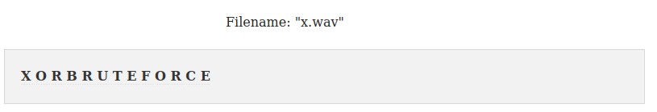
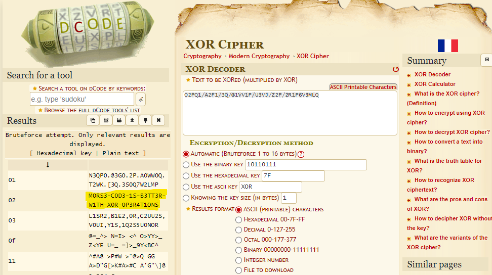

# Ηχητικό Μήνυμα Write-Up


| Δοκιμασία | Ηχητικό Μήνυμα |
| :------- | :----- |
| Δυσκολία | Mέτρια |
| Κατηγορία | Διάφορα (Misc) |
| Λύσεις | 23 |
| Πόντοι | 200 |

## Περιγραφή Δοκιμασίας

Η περιγραφή της δοκιμασίας αναφέρει:
```
Έλαβες ένα ηχητικό μήνυμα με περίεργους μονότονους ήχους. Μπορείς να αποκωδικοποιήσεις το μήνυμα;
Για να ολοκληρώσεις την δοκιμασία θα πρέπει να τοποθέτησεις το αποκρυπτογραφημένο μήνυμα μέσα στo FLAG{ ... } (π.χ. FLAG{decrypted_message})
```

Παράλληλα δίνετε ένα αρχείο `zip` το οποίο περιέχει 2 αρχεία ήχου τύπου `wav`.

## Επίλυση
### Ανάλυση αρχείου x.wav

Το αρχείο `x.wav` φάινεται να περιέχει ήχους από τελείες και παύλες τις οποίες μπορούμε να τις αποκωδικοποιήσουμε σαν morse code.

Αποκωδικοποιώντας το morse code μήνυμα του συγκριμένου αρχείου (με το χέρι, ή με χρήση εργαλείων σαν το [Morse Code Adaptive Audio Decoder](https://morsecode.world/international/decoder/audio-decoder-adaptive.html)) παίρνουμε το μήνυμα:
```
XORBRUTEFORCE
```

Μιας και το XOR brute force είναι ένα είδος επίθεσης, καταλαβαίνουμε πως αυτό μπορεί να είναι μια επίθεση που πρέπει να κάνουμε.



### Ανάλυση αρχείου cp.wav

Αποκωδικοποιώντας το morse code μήνυμα του άλλου αρχείου (όπως και πριν), βρίσκουμε ένα κρυπτογράφημα.
```
O2PQ1/A2F1/3Q/@1VV1P/U3VJ/Z2P/2R1P6V3MLQ
```

Εκμεταλλευόμαστε την πληροφορία που πήραμε από το προηγούμενο μήνυμα, και εκτελούμε ένα XOR brute force. Η επίθεση μπορεί να με την χρήση [XOR Cipher](https://www.dcode.fr/xor-cipher).



Κοιτώντας τα αποτελέσματα, παρατηρούμε πως για το κλειδί `02` το μήνυμα είναι:
```
M0RS3-C0D3-1S-B3TT3R-W1TH-X0R-0P3R4T1ONS
```

## Σημαία

```
FLAG{M0RS3-C0D3-1S-B3TT3R-W1TH-X0R-0P3R4T1ONS}
```