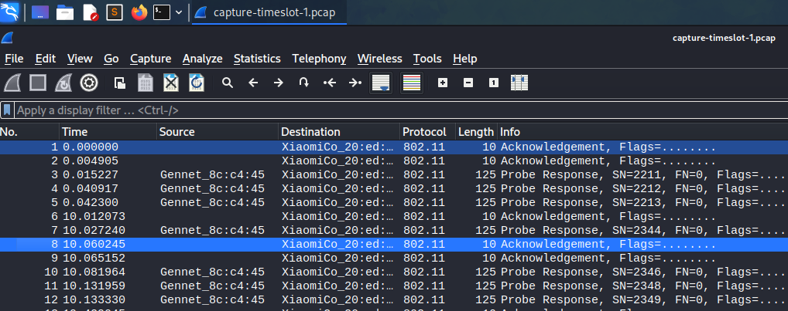

# WiFi πειστήρια Write-Up


| Δοκιμασία | WiFi πειστήρια |
| :------- | :----- |
| Δυσκολία | Δύσκολη |
| Κατηγορία | Ψηφιακή Εγκληματολογία (Forensics) |
| Λύσεις | 6 |
| Πόντοι | 575 |

## Επισκόπηση Δοκιμασίας

Από την περιγραφή καταλαβαίνουμε πως θα πρέπει να αναλύσουμε την δικτυακή κίνηση ενός υπόπτου και να βρούμε ψηφιακά στοιχεία για τις δραστηριότητές του. 

Μας δίνεται λοιπόν ένα zip με 2 αρχεία ροών πακέτων.

## Επίλυση

Ανοίγοντας τα αρχεία pcap που μας δόθηκαν χρησιμοποιώντας το WireShark μπορούμε να δούμε ότι τα πακέτα που έχουν συλληφθεί αποτελούν μέρος της κρυπτογραφημένης κίνησης WiFi του υπόπτου.



Αφού η κίνηση είναι κρυπτογραφημένη, μπορούμε αρχικά να προσπαθήσουμε να σπάσουμε τον κωδικό πρόσβασης του WiFi, ώστε να μπορούμε να αποκρυπτογραφήσουμε την κίνηση. Μπορούμε να το κάνουμε αυτό χρησιμοποιώντας το `aircrack-ng` και μια λίστα κωδικών (dictionary attack):
```
aircrack-ng ./capture-timeslot-1.pcap -w /usr/share/seclists/Passwords/WiFi-WPA/probable-v2-wpa-top4800.txt
```
Στην παραπάνω εντολή, χρησιμοποιήσαμε την λίστα `probable-v2-wpa-top4800.txt` από το πρότζεκτ `seclists` το οποίο περιέχει αρκετούς συχνούς κωδικούς WiFi.


Καταφέραμε να σπάσουμε τον κωδικό πρόσβασης του WiFi:
```
SSID: EasyMoney
Password: lamborghini
```

Μπορούμε τώρα να φορτώσουμε ξανά τα αρχεία pcap στο WireShark και να τα αποκρυπτογραφήσουμε χρησιμοποιώντας τον κωδικό πρόσβασης WiFi:


Στην συνέχεια, αφού ελέγξαμε διάφορα πρωτόκολλα, εστιάσαμε στο πρωτόκολλο HTTP όπου ανακαλύψαμε ότι έγιναν αιτήματα σε έναν συγκεκριμένο ιστότοπο.
Τα αιτήματα υποβλήθηκαν σε μια web εφαρμογή προς στην ιστοσελίδα `secure-app.pmdk.ctflib.eu:4242`.

Στην συνέχεια μπορούμε να προσπαθήσουμε να ανακτήσουμε την web εφαρμογή από την ροή των πακέτων. Για να το καταφέρουμε αυτό, πρέπει να ψάξουμε αρκετά στις 2 ροές καθώς πολλά πακέτα έχουν χαθεί ή έχουν καταστραφεί.


Καταφέραμε να εξάγουμε όλα τα αρχεία εκτός από ένα. Δεν μπορέσαμε να εξαγάγουμε το αρχείο με το όνομα `sjcl.js`, καθώς πάρα πολλά από τα πακέτα που τον περιείχαν ήταν κατεστραμμένα ή έλειπαν. Ψάχνοντας αυτό το αρχείο στο Google και αντιστοιχίζοντας μέρη του περιεχομένου του, ανακαλύψαμε ότι πρόκειται για την βιβλιοθήκη `Stanford Javascript Crypto Library (SJCL)` διαθέσιμη για λήψη από το `https://github.com/bitwiseshiftleft/sjcl/blob/master/sjcl.js`

Έτσι μπορέσαμε να ανακτήσουμε όλα τα αρχεία της web εφαρμογής:


Στην συνέχεια, αφού είχαμε όλα τα αρχεία ανοίξαμε την εφαρμογή η οποία έμοιαζε με μια εφαρμογή chating.


Διαβάζοντας τον κώδικα JavaScript της εφαρμογής μέσα στο `chat.js` μπορούμε να δούμε ότι η εφαρμογή χρησιμοποιεί websockets για να επικοινωνεί με τον διακομιστή της εφαρμογής.

Επιστρέφοντας στην ροή πακέτων, μπορούμε να αναζητήσουμε βάση του πρωτοκόλλου websocket για να δούμε την επικοινωνία της εφαρμογής με τον διακομιστή της. Στο πρώτο αρχείο, βρήκαμε μια σειρά από μηνύματα που μοιάζουν με συνομιλία.


Μέσα από αυτά τα πακέτα μπορέσαμε να βρούμε τα παρακάτω μηνύματα:
```
{"type":"init","name":"c2739db818d175efe4e4a8f0998e4834273d7d29f8f3cb0c9fbd1ebac690f770","state":"181dcff2143dea315065aef7c898f551859fdbd40b3661ee181356ade8123dd2"}
{"type":"connected","name":"04e9090fcaf94f7aa4ced8f9fbf585b055671a46627ec0116b45a164e29cd0e5"}
{"message":[115,112,151,87,154,205,18,138,64,181,34,214,74,33,54]}
{"type":"message","name":"04e9090fcaf94f7aa4ced8f9fbf585b055671a46627ec0116b45a164e29cd0e5","message":[231,169,223,143,201,103,205,141,237,138,185,115,182,233,252,208,52,231,228,146,156,109,228,69,166,249,203,87,69,253,39,52,206,169,222,206,223,97,209,144,227,195,133,38,175,160,253,211,51,236,250,146,153,120,191]}
{"type":"message","name":"04e9090fcaf94f7aa4ced8f9fbf585b055671a46627ec0116b45a164e29cd0e5","message":[159,197,139,45,5,38,112,119,206,31,211,99,32,93,221,202,26,178,18,89,148,247,99,65,80,220,31,156,120,146,70,125,187,235,255,11,78,37,38,32,144,65,140,107,33,80,219,152,29,181,16,88,151,162,101,20,83,134,27,146,115,146,23,33,224,190,175,12,27,58]}
```

Είδαμε πως τα μηνύματα που περιέχουν `"type"` είναι εισερχόμενα μηνύματα ενώ τα υπόλοιπα μηνύματα είναι εξερχόμενα μηνύματα.
Επιπλέον είδαμε πως τα μηνύματα είναι κρυπτογραφημένα.


Μπορούμε τώρα να [αλλάξουμε τον κώδικα](files/chat.js) για να αναπαράγουμε ξανά όλα τα μηνύματα σαν να είχαν σταλεί μέσο websocket.
Και έτσι ανακτήσαμε τη συνομιλία των χρηστών:


## Σημαία

```
FLAG{a0c88f089eb76614f13ec1796d9bb5a0bf4ff9894c00140737ff959265e97efe}
```
