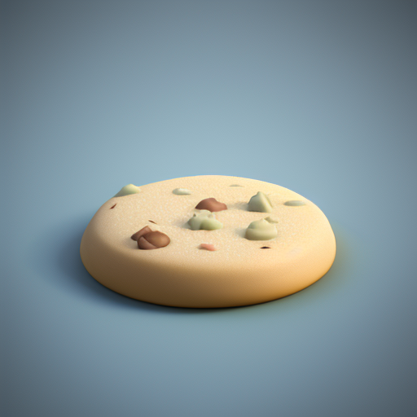
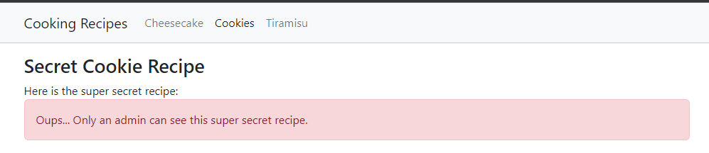
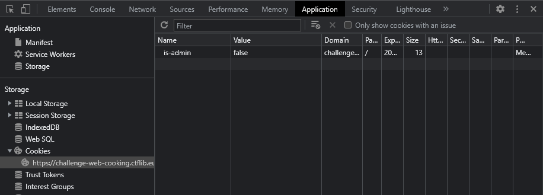
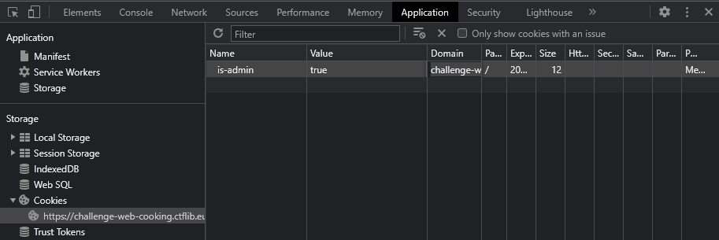
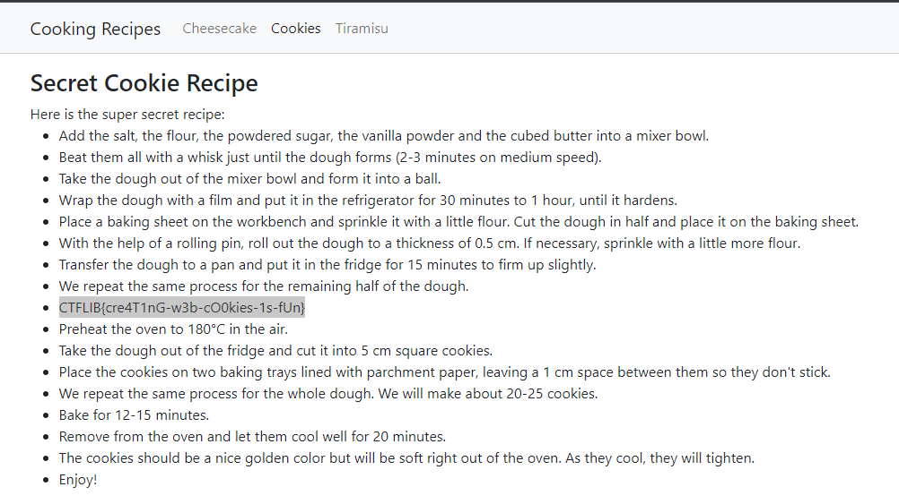

# Μαγειρική στο Διαδίκτυο Write-Up



| Δοκιμασία | Μαγειρική στο Διαδίκτυο |
| :------- | :----- |
| Δυσκολία | Εύκολη |
| Κατηγορία | Demo, Παγκόσμιος Ιστός (Web) |
| Λύσεις | 29 |
| Πόντοι | 0 |

## Περιγραφή Δοκιμασίας

Στην περιγραφή της δοκιμασίας περιγράφετε πως έχουμε μια ιστοσελίδα με συνταγές και εμείς πρέπει να διαβάσουμε την συνταγή για τα μπισκότα, η οποί όμως δεν είναι διαθέσιμη πια στην σελίδα.

## Επίλυση

Ανοίγουμε την σελίδα της δοκιμασίας http://challenge-web-cooking.ctflib.eu και πάμε στην συνταγή για τα μπισκότα:



Αλλά η συνταγή δεν είναι πλέον διαθέσιμη και το μήνυμα αναφέρει πως μόνο οι διαχειριστές μπορούν να την δουν.

Για να δει η σελίδα αν είμαστε διαχειριστής μπορεί να κοιτάει τα cookies του browser μας. Για αυτό ας ανοίξουμε τα εργαλεία προγραμματιστή για να δούμε τι cookies έχει ο browser μας στην σελίδα αυτή:



Βλέπουμε πως υπάρχει ένα cookie με το όνομα `is-admin` το οποίο είναι `false`. Τι θα γίνει άραγε α το κάνουμε `true`; Για να δούμε... κάνουμε διπλό κλικ και αλλάζουμε την τιμή:



Τώρα κάνουμε ανανέωση της σελίδα για να δούμε τι θα γίνει:



Τέτοια! Η σελίδα τώρα νομίζει πως είμαστε διαχειριστές και μας έδωσε την συνταγή.

## Σημαία

```
CTFLIB{cre4T1nG-w3b-cO0kies-1s-fUn}
```
