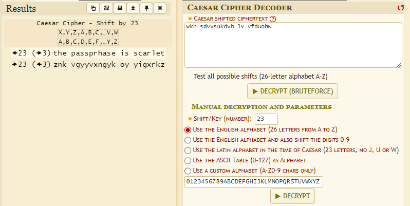

# Το bar στην οδό Καίσαρα Write-Up


| Δοκιμασία | Το bar στην οδό Καίσαρα |
| :------- | :----- |
| Δυσκολία | Εύκολη |
| Κατηγορία | Demo, Κρυπτογραφία (Cryptography) |
| Λύσεις | 33 |
| Πόντοι | 0 |

## Περιγραφή Δοκιμασίας

```
O Σέρλοκ Χολμς και ο Δρ. Γουάτσον χρειάζονται την βοήθεια σου. Τα στοιχεία που έχουν μαζέψει αποκάλυψαν πως ο ύποπτος που ψάχνουν κρύβεται σε ένα μυστηριώδες bar στην οδό Καίσαρα. Το μαγαζί όμως δεν είναι ανοιχτό προς όλους αφού ένας σωματοφύλακας στην πόρτα του αφήνει να μπουν μόνο όσοι γνωρίζουν τη μυστική φράση. Το μόνο στοιχείο που έχουν για την κωδική λέξη είναι ένα κρυπτογραφημένο μήνυμα και έναν αριθμό. Μπορείς να ρίξεις φως στο μυστήριο και να ανακαλύψεις την φράση κλειδί να μπουν στο bar χωρίς να κινήσουν υποψίες;

Τα στοιχεία είναι:

το Κρυπτογραφημένο Μήνυμα wkh sdvvsukdvh lv vfduohw και
ο Αριθμός 23
```

## Επίλυση

Από την περιγραφή και τον τίτλο της δοκιμασίας καταλαβαίνουμε πως το μήνυμα `wkh sdvvsukdvh lv vfduohw` είναι Caesar Cipher το οποίο μπορούμε να αποκρυπτογραφήσουμε με το χέρι ή με κάποιο εργαλείο σαν το [Caesar Cipher Decoder](https://www.dcode.fr/caesar-cipher). Ο αριθμός `23` που μας δίνεται φαίνεται να είναι το κλειδί της κρυπτογράφησης.



Με την αποκρυπτογράφηση βγαίνει το μήνυμα `the passprhase is scarlet`. Με την κωδική λέξη `scarlet` μπορούμε να ανοίξουμε το `zip` και να διαβάσουμε την σημαία.

## Σημαία

```
FLAG{w3_l0VE_C4eS4r_c1ph3R}
```
