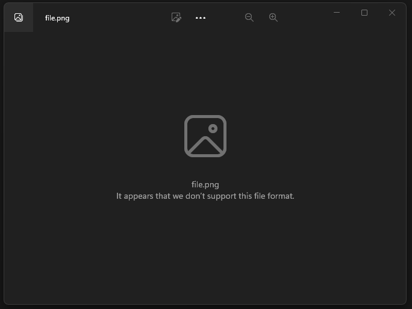
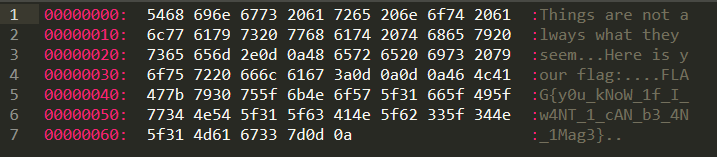

# Κατεστραμμένη Φωτογραφία Write-Up


| Δοκιμασία | Κατεστραμμένη Φωτογραφία |
| :------- | :----- |
| Δυσκολία | Εύκολη |
| Κατηγορία | Demo, Διάφορα (Misc) |
| Λύσεις | 34 |
| Πόντοι | 0 |

## Περιγραφή Δοκιμασίας

Η περιγραφή της δοκιμασίας μας αναφέρει:
```
Μου έστειλε ένας φίλος μια φωτογραφία αλλά δεν μπορώ να την ανοίξω… κάτι δεν πάει καλά. Μπορείς να του ρίξεις μια ματιά;
```

Παράλληλα μας δίνει ένα `zip` με ένα αρχείο `png`.

## Επίλυση

Ανοίγοντας την φωτογραφία εμφανίζεται ένα μήνυμα πως η φωτογραφία είναι κατεστραμμένη.



Δοκιμάζουμε να ανοίξουμε την φωτογραφία με ένα επεξεργαστή κειμένου (notepad, notepad++, sublime text κτλ.). Με το που το ανοίξουμε βλέπουμε πως δεν είναι φωτογραφία αλλά αρχείο κειμένου:



```
Things are not always what they seem.
Here is your flag:

FLAG{y0u_kNoW_1f_I_w4NT_1_cAN_b3_4N_1Mag3}

```

## Σημαία

```
FLAG{y0u_kNoW_1f_I_w4NT_1_cAN_b3_4N_1Mag3}
```
