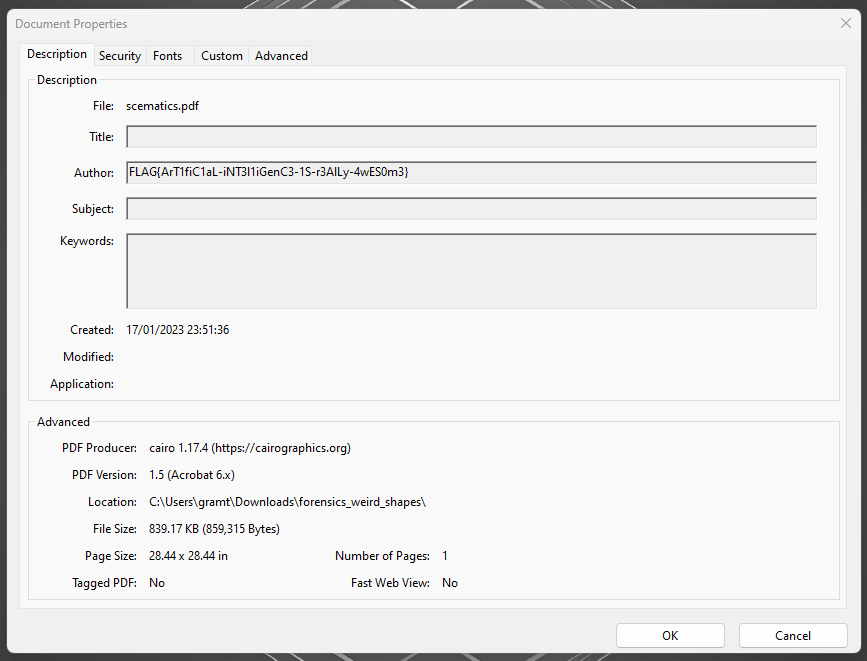

# Περίεργα Σχήματα Write-Up


| Δοκιμασία | Περίεργα Σχήματα |
| :------- | :----- |
| Δυσκολία | Εύκολη |
| Κατηγορία | Demo, Ψηφιακή Εγκληματολογία (Forensics) |
| Λύσεις | 31 |
| Πόντοι | 0 |

## Περιγραφή Δοκιμασίας

Η περιγραφή της δοκιμασίας μας αναφέρει:
```
Είμαι μέλος σε ένα forum στο διαδίκτυο με θέμα τα μυστήρια. Ένας ανώνυμος χρήστης σήμερα ανέβασε ένα έγγραφο με ένα πολύπλοκο σχήμα και προσπαθούμε να βρούμε ποιος το έφτιαξε. Μπορείς να μας βοηθήσεις;
```

Παράλληλα μας δίνει ένα `zip` με ένα αρχείο `pdf`.

## Επίλυση

Ανοίγοντας το αρχείο PDF βλέπουμε μια εικόνα με σχήματα. Για να βρούμε ποιος δημιούργησε το έγγραφο κοιτάμε τα metadata του αρχείου πηγαίνοντας στο μενού `File > Properties...`.



Και βρίσκουμε την σημαία δίπλα στο πεδίο του `Author`.

## Σημαία

```
FLAG{ArT1fiC1aL-iNT3l1iGenC3-1S-r3AlLy-4wES0m3}
```
