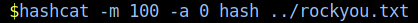
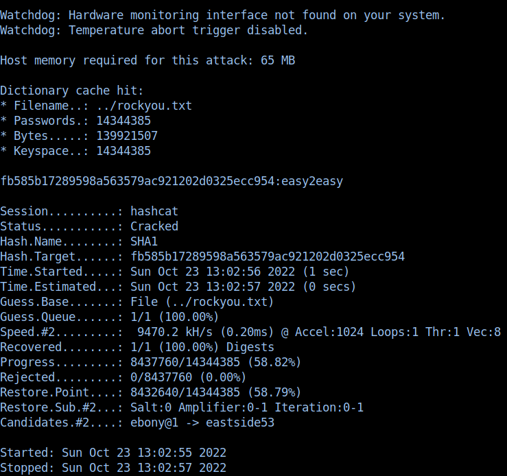
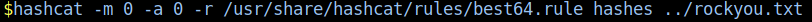
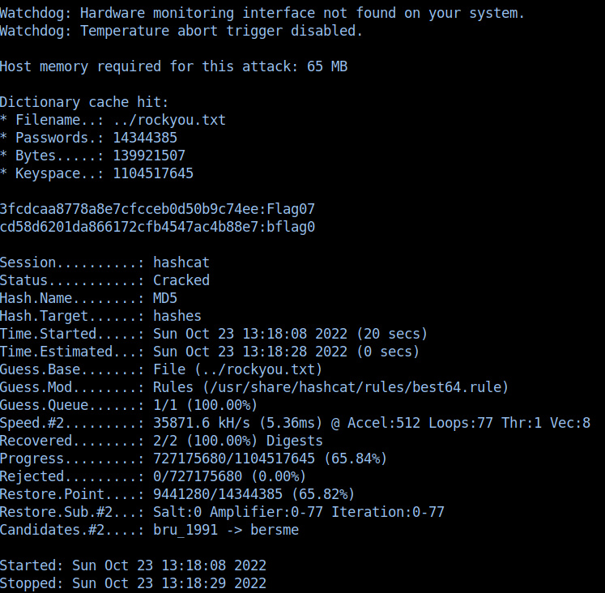

# What the HASH! Write-Up


| Δοκιμασία | What the HASH! |
| :------- | :----- |
| Δυσκολία | Εύκολη |
| Κατηγορία | Διάφορα (Misc) |
| Λύσεις | 23 |
| Πόντοι | 200 |

## Περιγραφή Δοκιμασίας

```
Ο εργοδότης σου ανέθεσε να διδάξεις στους νέους υπαλλήλους του τμήματος κυβερνοασφάλειας τεχνικές password cracking. Μην τον κάνεις ρεζίλι..
```

Παράλληλα μας δίνεται και ένα zip που μέσα πέρα από τα hashes περιέχει και ένα αρχείο με οδηγίες:
```
Για την ολοκλήρωση της δοκιμασίας πρέπει να ακολουθήσετε τα παρακάτω βήματα:

	1. Σπάστε τα 4 hashes τα οποία βρίσκονται στα 3 αρχεία που δίνονται
	2. Συνδυάστε τις 4 συμβολοσειρές που βρήκατε από το προηγούμενο βήμα σε 1 συμβολοσειρά.
	2. Κωδικοποιήστε την παραγόμενη συμβολοσειρά με τη συνάρτηση κατακερματισμού (hash) MD5.
	3. Βάλτε το παραγόμενο hash στην μορφή της σημαίας.

Παράδειγμα:

	Ας υποθέσουμε ότι έχουμε σπάσει τα 4 hashes και έχουμε τα ακόλουθα αποτελέσματα:

	αρχείο hash1 - StringA
	αρχείο hash2 - StringB
	αρχείο hashes3 1o hash - StringC
	αρχείο hashes3 1o hash - StringD

	Για να λύσουμε την πρόκληση πρέπει:

	1. Να συνδυάσουμε τις 4 συμβολοσειρές: StringAStringBStringCStringD
	2. Να κωδικοποιήσουμε την παραγόμενη συμβολοσειρά με τη συνάρτηση κατακερματισμού MD5: 16d4d419dad4e7e99d8fbcafbfbb07e0
	3. Βάλτε το παραγόμενο hash στην μορφή της σημαίας: FLAG{16d4d419dad4e7e99d8fbcafbfbb07e0}
```

## Επίλυση

Για κάθε hash που μας δίνεται, μπορούμε να χρησιμοποιήσουμε το εργαλείο `hashcat` σε συνδιασμό με μια λίστα από passwords (πχ. την `rockyou.txt`) για να σπάσουμε το hash.

### Hash 1

- Hash : `fb585b17289598a563579ac921202d0325ecc954`
- Sha1 hash (mode 100)
- Dictionary attack with rockyou.txt.



- Cracked!



### Hash 2

- Hash : `41a7fde8875b7ad470c8352bdce1955e5e1f6902b5679891f7e8a9d9fca238b9`
- Sha2 256 with salt (mode 1410)
- Dictionary attack with rockyou.txt


- Cracked!


### Hash 3

- Hashes : `3fcdcaa8778a8e7cfcceb0d50b9c74ee` `cd58d6201da866172cfb4547ac4b88e7`
- md5 
- Rule base attack : /usr/share/hashcat/rules/best64
- Dictionary attack with rockyou.txt



- Cracked!




### Σημαία

Από τα hashes που σπάσαμε έχουμε: 
```
easy2easy
1saltbox
Flag07
bflag0
```

Οπότε για να βγρούμε την σημαία κάνουμε:
```
md5(easy2easy1saltboxFlag07bflag0) = 9ec6518f2ee7c8df503a7500446dd466
```

Άρα η σημαία μας είναι:
```
FLAG{9ec6518f2ee7c8df503a7500446dd466}
```
