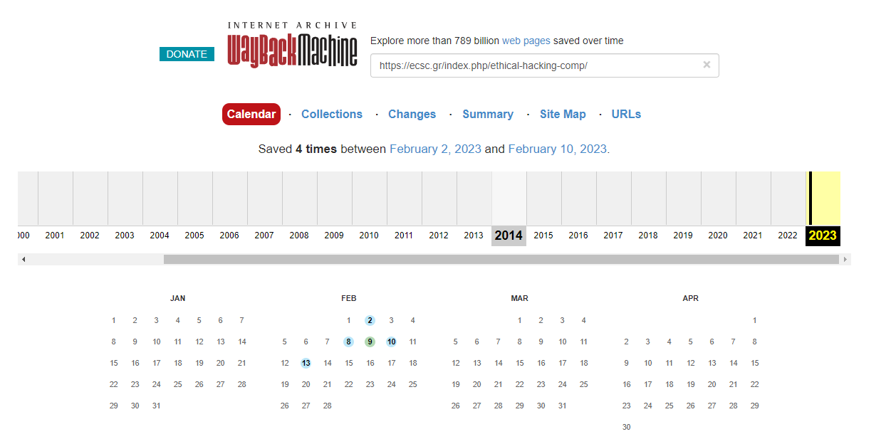
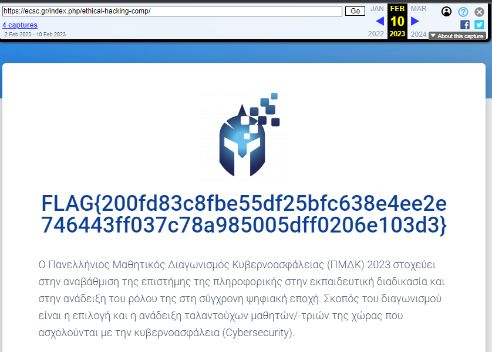

# Χρονομηχανή Write-Up


| Δοκιμασία | Χρονομηχανή |
| :------- | :----- |
| Δυσκολία | Εύκολη |
| Κατηγορία | Συλλογή πληροφοριών από ανοικτές πηγές (Open Source Intelligence, OSINT) |
| Λύσεις | 10 |
| Πόντοι | 519 |

## Επισκόπηση Δοκιμασίας

Η περιγραφή της δοκιμασίας μας αναφέρει:
```
Μια σημαία διέρρευσε στην κεντρική ιστοσελίδα του διαγωνισμού πριν μερικές ημέρες. Οι διοργανωτές την κατέβασαν μόλις το αντιλήφθηκαν. Μπορείς να βρεις την σημαία που διέρρευσε;
```

## Επίλυση

Υπάρχουν online ιστοσελίδες οι οποίες μπορούν να μας δείξουν πως ήταν μια ιστοσελίδα στο παρελθόν. Μια από αυτές τις ιστοσελίδες (ίσως η μεγαλύτερη) είναι το [WayBackMachine](https://archive.org/web/).


Πηγαίνοντας στην ιστοσελίδα WayBackMachine και αναζητώντας την κυρίως ιστοσελίδα τους διαγωνισμού [https://ecsc.gr/index.php/ethical-hacking-comp/](https://web.archive.org/web/20230000000000*/https://ecsc.gr/index.php/ethical-hacking-comp/) βρίσκουμε αρκετά στιγμιότυπα της σελίδας να έχουν τραβηχθεί:



Αν ψάξουμε τα προηγούμενα στιγμιότυπα θα δούμε πως στις 10 Φεβρουαρίου ([FEBRUARY 10, 2023 στις 11:28:37](https://web.archive.org/web/20230210112837/https://ecsc.gr/index.php/ethical-hacking-comp/)) είχε διαρρεύσει η σημαία στην σελίδα του.



## Σημαία

```
FLAG{200fd83c8fbe55df25bfc638e4ee2e746443ff037c78a985005dff0206e103d3}
```
