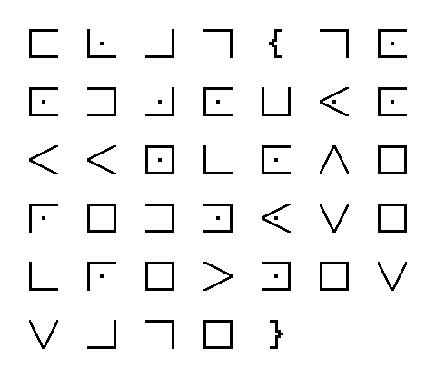

# Μυστηριώδης σύμβολα Write-Up


| Δοκιμασία | Μυστηριώδης σύμβολα |
| :------- | :----- |
| Δυσκολία | Εύκολη |
| Κατηγορία | Διάφορα (Misc) |
| Λύσεις | 30 |
| Πόντοι | 200 |

## Επισκόπηση Δοκιμασίας

Η περιγραφή της δοκιμασίας μας αναφέρει:
```
Τι είναι αυτά τα περίεργα σύμβολα;
```

Και μαζί μας δίνεται και ένα zip με μέσα μια εικόνα με σύμβολα:



## Επίλυση

Με λίγο ψάξιμο αναγνωρίζουμε πως τα σύμβολα αυτά είναι ένα Pigpen Cipher, το οποίο έχει την ακόλουθη αντιστοίχιση:

| Σύμβολο           | Γράμμα |
| :---------------: | :----: |
|  | `A`    |
|  | `B`    |
|  | `C`    |
|  | `D`    |
|  | `E`    |
|  | `F`    |
|  | `G`    |
|  | `H`    |
|  | `I`    |
|  | `J`    |
|  | `K`    |
|  | `L`    |
|  | `M`    |
|  | `N`    |
|  | `O`    |
|  | `P`    |
|  | `Q`    |
|  | `R`    |
|  | `S`    |
|  | `T`    |
|  | `U`    |
|  | `V`    |
|  | `W`    |
|  | `X`    |
|  | `Y`    |
|  | `Z`    |

Και έχουμε και 2 σύμβολα τα οποία δεν είναι στο Pigpen Cipher αλλά μπορούμε να μαντέψουμε πως είναι:
| Σύμβολο           | Γράμμα |
| :---------------: | :----: |
|  | `}`    |
|  | `}`    |

## Σημαία

Αποκωδικοποιώντας το μήνυμα της φωτογραφίας παίρνουμε την σημαία:
```
FLAG{GOODJOBYOUUNCOVEREDMYSECRETMESSAGE}
```
