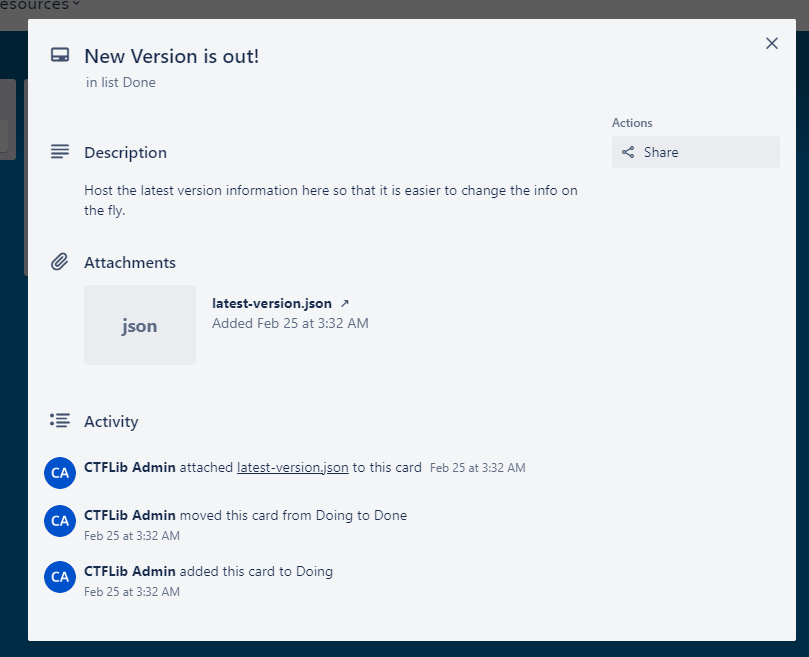
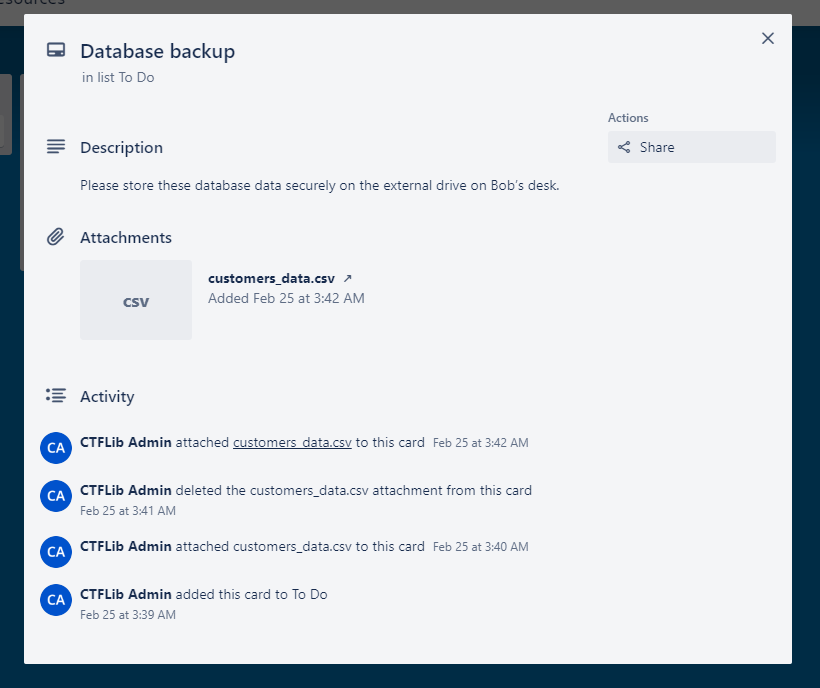
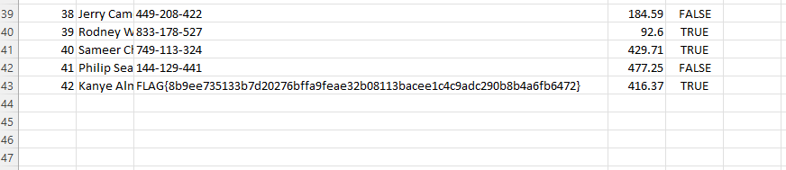

# PBoard Write-Up


| Δοκιμασία | PBoard |
| :------- | :----- |
| Δυσκολία | Μέτρια |
| Κατηγορία | Διάφορα (Misc) |
| Λύσεις | 10 |
| Πόντοι | 519 |

## Επισκόπηση Δοκιμασίας

Η περιγραφή της δοκιμασίας μας μιλά για μια ενημέρωση κάποιας εφαρμογής.
```
Καταπληκτική εφαρμογή το PBoard. Να θυμηθώ να την δώ αν έχει βγεί καμία καινούρια ενημέρωση με καινούρια χαρακτηριστικά!
```

Και μαζί μας δίνετε ένα zip αρχείο με μέσα ένα εκτελέσιμο αρχείο με όνομα `updater`.

## Επίλυση

Η εκτέλεση του προγράμματος `updater` δεν μας δίνει πολλές πληροφορίες:
```cmd
thanos@banaba$ ./updater
There is a new version 3.1 available!
Changelog:
We imporved the sercurity of the application! Your data are always safe!
```

Μας αναφέρει πως υπάρχει απλά μια καινούρια έκδοση της εφαρμογής.

Κοιτώντας τα αλφαριθμητικά που έχει μέσα το πρόγραμμα `updater` (με την χρήση της εντολής `strings`) ανακαλύπτουμε κάποια κομμάτια από URL:
```
https://H
[]A\A]A^A_
trello.com
/download/latest-version.json
/1/cards/63f9651eae24a9d014e9a29d
/attachments/63f96541a9ab757f0fb4c553
```

Καταλαβαίνουμε πως το `/download/latest-version.json` θα πρέπει να πάει στο τέλος και το `trello.com` μιας και είναι το όνομα. Οπότε παίζοντας λίγο με την σειρά των URL parts κατασκευάσαμε το URL:
```
https://trello.com/1/cards/63f9651eae24a9d014e9a29d/attachments/63f96541a9ab757f0fb4c553/download/latest-version.json
```

Το οποίο μας οδηγεί στο JSON αρχείο:
```json
{
	"version" : {
		"name" : "v3.1",
		"major" : 3,
		"minor" : 1,

		"changelog" : "We imporved the sercurity of the application! Your data are always safe!"
	}
}
```
Το οποίο δεν μας βοηθάει κάπου, αλλά περιέχει το μήνυμα που μας εμφανίζει και η εφαρμογή κατά την εκτέλεση.

Κοιτώντας πάλι το URL βλέπουμε πως το αρχείο αυτό είναι `attachment` σε κάτι, οπότε αφαιρώντας το 2ο κομμάτι του URL που αναφέρεται στο αρχείο έχουμε:
```
https://trello.com/1/cards/63f9651eae24a9d014e9a29d/
```

Το οποίο μας επιστρέφει πληροφορίες σε JSON:
```json
{"id":"63f9651eae24a9d014e9a29d","badges":{"attachmentsByType":{"trello":{"board":0,"card":0}},"location":false,"votes":0,"viewingMemberVoted":false,"subscribed":false,"fogbugz":"","checkItems":0,"checkItemsChecked":0,"checkItemsEarliestDue":null,"comments":0,"attachments":1,"description":true,"due":null,"dueComplete":false,"start":null},"checkItemStates":[],"closed":false,"dueComplete":false,"dateLastActivity":"2023-02-25T01:38:34.062Z","desc":"Host the latest version information here so that it is easier to change the info on the fly.","descData":{"emoji":{}},"due":null,"dueReminder":null,"email":null,"idBoard":"63f964ffd03f01c6f14ab44e","idChecklists":[],"idList":"63f964ffd03f01c6f14ab457","idMembers":[],"idMembersVoted":[],"idShort":1,"idAttachmentCover":null,"labels":[],"idLabels":[],"manualCoverAttachment":false,"name":"New Version is out!","pos":65535,"shortLink":"9evAIOPK","shortUrl":"https://trello.com/c/9evAIOPK","start":null,"subscribed":null,"url":"https://trello.com/c/9evAIOPK/1-new-version-is-out","cover":{"idAttachment":null,"color":null,"idUploadedBackground":null,"size":"normal","brightness":"dark","idPlugin":null},"isTemplate":false,"cardRole":null}
```

Από αυτές τις πληροφορίες μπορούμε να δούμε μερικά καινούρια URL:
```
shortUrl: https://trello.com/c/9evAIOPK
url     : https://trello.com/c/9evAIOPK/1-new-version-is-out
```

Το οποίο μας παραπέμπει σε μια σελίδα (Trello board):



Ψάχνοντας στην σελίδα αυτή βρίσκουμε μερικά αρχεία πελατών:



Και μέσα βρίσκουμε την σημαία:




## Σημαία

```
FLAG{8b9ee735133b7d20276bffa9feae32b08113bacee1c4c9adc290b8b4a6fb6472}
```

