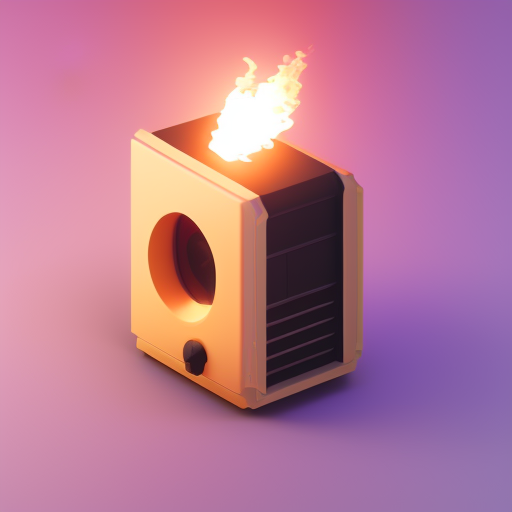
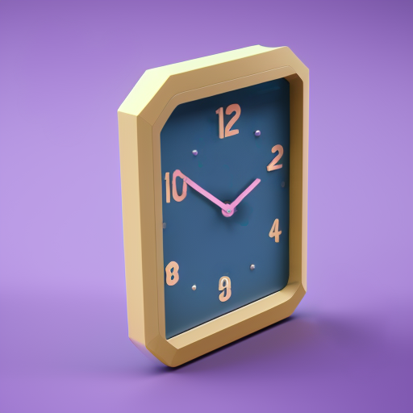
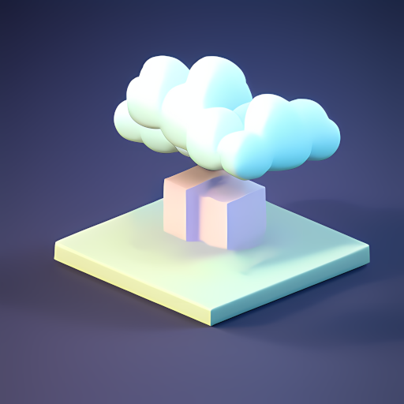

# Images for the Challenges

## Περιγραφή
Οι παρακάτω εικόνες δημιουργήθηκαν με την χρήση του Stable Diffusion (πιο συγκεκριμένα με το μοντέλο `v2-1_512-nonema-pruned.ckpt`) και με την βοήθεια του [Stable Diffusion WebUI](https://github.com/AUTOMATIC1111/stable-diffusion-webui) και των extension του.

Για την παραγωγή των φωτογραφιών χρησιμοποιήθηκε το παρακάτω πρότυπο promt από το [publicprompts.art](https://publicprompts.art/block-structures-prompt/):
```text
tiny cute isometric PER_CHALLENGE_KEYWORKS_HERE, soft smooth lighting, soft colors, soft colors, 100mm lens, 3d blender render, trending on polycount, centered
```
με `CFG scale: 10`, `Sampler: euler_a` και `steps: 50`


## Εικόνες

### Κύριες Δοκιμασίες

| Δοκιμασία 01 | Δοκιμασία 02 | Δοκιμασία 03 | Δοκιμασία 04 |
|-------------|-------------|-------------|-------------|
|  |  |  | |

| Δοκιμασία 05 | Δοκιμασία 06 | Δοκιμασία 07 | Δοκιμασία 08 |
|-------------|-------------|-------------|-------------|
|  |  |  |  |

| Δοκιμασία 09 | Δοκιμασία 10 | Δοκιμασία 11 | Δοκιμασία 12 |
|-------------|-------------|-------------|-------------|
|  |  |  |  |

### Demo Δοκιμασίες

| Δοκιμασία 01 | Δοκιμασία 02 | Δοκιμασία 03 | Δοκιμασία 04 |
|-------------|-------------|-------------|-------------|
|  |  |  |  |

### Extra Δοκιμασίες

| Δοκιμασία 01 | Δοκιμασία 02 | Δοκιμασία 03 | Δοκιμασία 04 |
|-------------|-------------|-------------|-------------|
|  |  |  |  |

| Δοκιμασία 05 |
|-------------|
|  |
